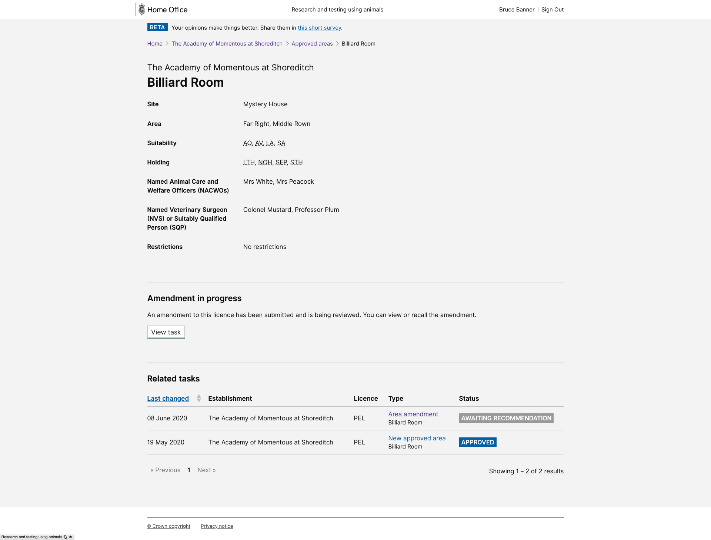

# Summary as of Wednesday 17 June 2020 

# Sprint 60

## Just Done
* TEXT_HERE
* TEXT_HERE
* TEXT_HERE

## About to Do/Doing
* TEXT_HERE
* TEXT_HERE
* TEXT_HERE

## Bugs Fixed this week
The following bugs were fixed this week.
[Bug Fixes week to Wednesday 17 June 2020](graphs/bugs17062020.png)

We planned the following issues in this sprint 
[Sprint 60](graphs/sprint17062020.png)

## Support tickets and known issues
[Link to Support Board](https://collaboration.homeoffice.gov.uk/jira/secure/RapidBoard.jspa?rapidView=1717&selectedIssue=ASSB-253)

[Support board - cached](graphs/supportBoard17062020.png)

## Click here for metrics / progress against plan
[Sprint 60](graphs/progress17062020.png)

[Post Release Roadmap](graphs/roadmap17062020.png)

## These are the goals for the current sprint:

1. Complete the research on Cat E PILs 
2. Design - Improve task history 
3. Content design - complete content for PIL-E 
4. Working software - reporting RA, PPL SLAs and PILs

## Sample Design Prototypes

 

## Google Analytics for this report
[Google Analytics](graphs/GA17062020.png)

