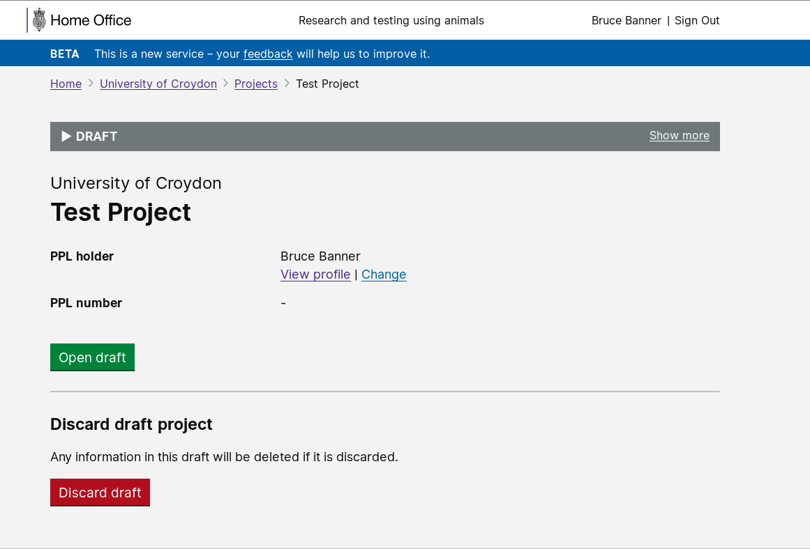
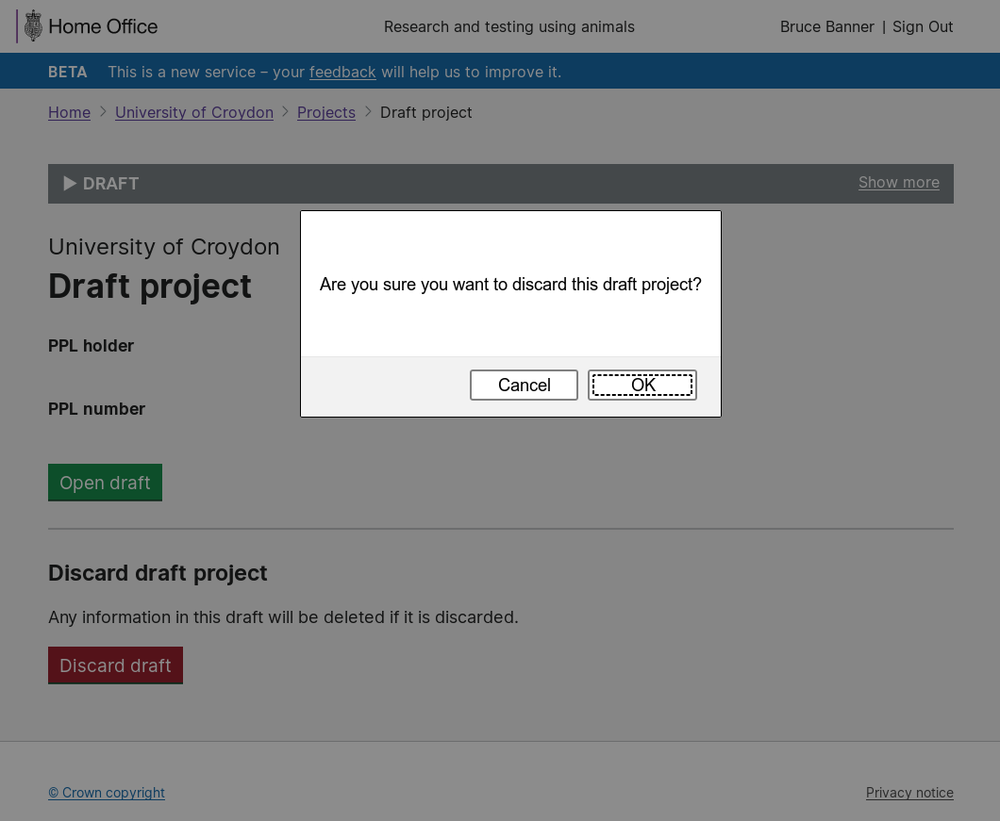

# Summary as of 17th July 2019 

# Sprint 37 - mid-sprint

## What's Blocking us / Issues
* We are still working to get ATO (authority to operate)

## Just Done
* Discard project versions
* Licence number generator
* Accessibility audit 

## About to Do/Doing
* ASRU user can update PEL
* ASRU user can modify ASRU permissions
* .ppl file upload

## Click here for metrics / progress against plan
[Week 1 - Sprint 37](graphs/progress17072019.png)

## Countdown to release: critical and major bugs
This image shows all the issues that need to be addressed before the first release.
[Outstanding Critical and Major Bugs](graphs/criticalAndMajor17072019.png)

## Risks
[Links to Project Risks in Trello](https://trello.com/b/VuFuCL7t/risk-register-and-kpis-asl-delivery) 
[Link to Risk Chart](graphs/risk17072019.png)

## Sprint Planning
* We planned the following issues in sprint planning [Link to Issues in Jira](https://jira.digital.homeoffice.gov.uk/secure/RapidBoard.jspa?rapidView=261)    [\(Cached Image\)](graphs/sprint17072019.png)

Our goals for the sprint are:
1. ATO 
2. Digital and Print view for new and legacy licences - working software 
3. Declarations review 
4. Decide release schedule 
5. High level plan for Beta service assessment 
6. Cat E Pils - Design

## Screenshots of the working software 

 

 

## Google Analytics for this report
[Google Analytics](graphs/GA17072019.jpg)

