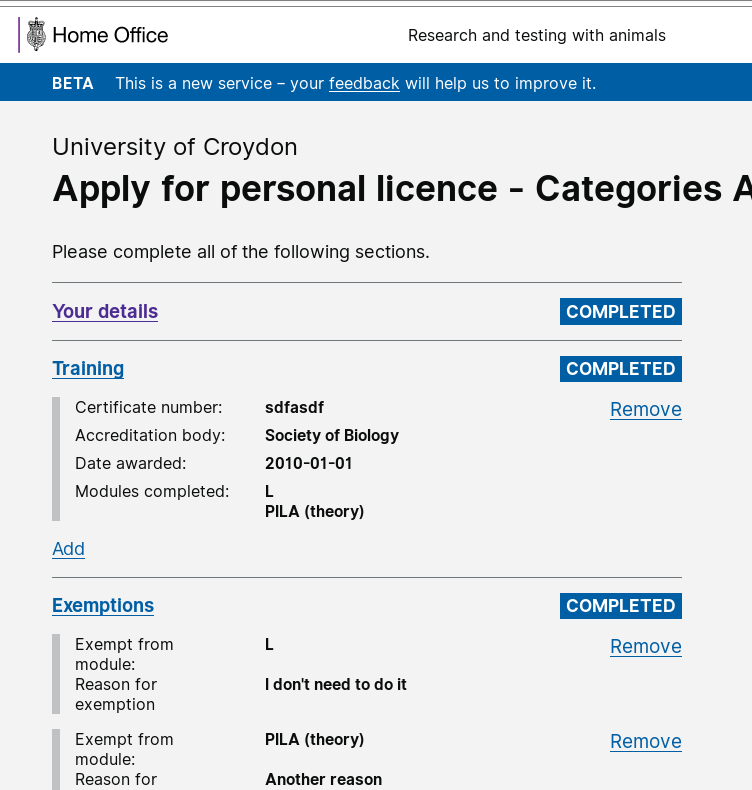

# Summary as of 17th October 2018 

# Sprint 19

## What's Blocking us / Issues
* We have now received authority to operate for data migration 

## Just Done
* Delivered working software for PIL applications 
* Designs for Research PPLs (including iteration user incorporating comments)
* First user research on PPLs and preparation for PPL research in Sprint 19

## About to Do/Doing
* Address technical debt resulting from PIL development (development)
* Preparing for Service Assessment (design and user research)
* User Research and Design iteration of PPL designs (design and user research)

## Things to be aware of
* We will attend an Alpha service assessment for our work on PILs at the end of this sprint 
* There is a meeting today of members of the team with HO Chief Security, Science & Innovation Officer to review progress

## Click here for our High-Level Road map
[Link to Live Road map in Trello](https://trello.com/b/gDQdE01u/asl-roadmap)    [\(Cached Image\)](graphs/ASLRoadMap17102018.jpg)

## Click here for metrics / progress against plan
[Week 1 - Sprint 19 - Release 1](graphs/progress17102018.png)

## Burnup Chart

[Burnup Chart](burnup17102018.md)

## Risks
[Links to Project Risks in Trello](https://trello.com/b/VuFuCL7t/risk-register-and-kpis-asl-delivery)    [\(Cached Image\)](graphs/ASLRiskRegister17102018.jpg)

[Risk Management Chart](graphs/risk17102018.png)

## Sprint Planning
* We planned the following issues in sprint planning today [Link to Issues in Jira](https://jira.digital.homeoffice.gov.uk/secure/RapidBoard.jspa?rapidView=261)    [\(Cached Image\)](graphs/sprint17102018.png)

Our goals for the previous sprint were:
1. Prepare for user research testing in sprint 19
>> *Goal met* 
2. Good first design for Research PPLs (including commenting)
>> *Goal met*
3. Finish PILs (Working software)
>> *Goal partially met - more work on PILs still to do*

Our goals for the sprint are:
1. Address Tech debt from PIL development 
2. Prepare for service assessment (Design and UR) 
3. Continue to Iterate and Validate PPL prototypes (Design and UR)

## Sample Design Prototype
Username: holc

Password: holc

PLEASE NOTE:
The software available on this link is work in progress. Sometimes when it's accessed changes will be being made that may mean it behaves strangely, or doesn't work at all. If you see something that doesn't look right, please try logging out and logging in again.  If that doesn't work, of you have any questions, please feel free to report what you see via [animalscience@digital.homeoffice.gov.uk](animalscience@digital.homeoffice.gov.uk).
