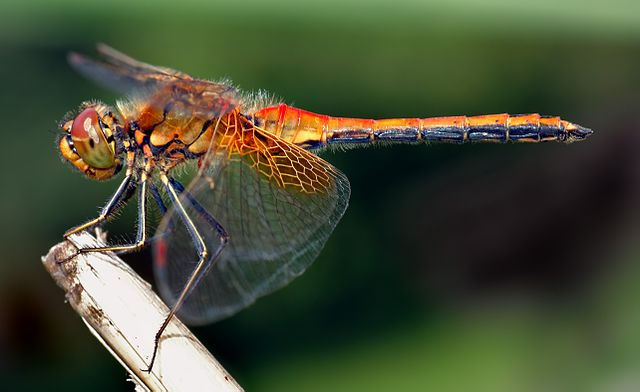

# Summary as of Wednesday 17 November 2021 

# Sprint 97 (Dragonfly)

## Just Done
* Held two RoPs feedback sessions with PPL holders - user research
* Scheduled one more RoPs feedback session - user research
* Minor visual improvements to task view screens - design
* Content improvements to automated emails sent to admins when someone who holds an account at their establishment has a PIL approved/revoked/amended/transferred - design
* Designs to prevent admins from being able to submit PPL applications/amendments/returns of procedures/retrospective assessments - design
* Content for new screens allowing management to track how many tasks staff have in progress/completed - design
* Removed unassigned tasks from ASRU users "My Tasks" - working software
* Content improvements to ROPs submission journey - working software
* Fixed issue with comment counts in repeating sections of PPLs showing incorrectly - working software
* General release of task search - working software

## About to Do/Doing
* Exploring how we might display and manage non-compliance flags - design
* Working with ASRU to add a new general constraint around moving animals between sites of an establishment - design
* Add in warning that PPL amendments require endorsement and AWERB approval for consistency with PPL applications - design
* Adding support for submission of 2022 ROPs - working software
* Improvements to task search filters - working software
* Reporting of numbers of assigned tasks per user - working software
* Modifications of PPL submission permissions - working software

## Bugs Fixed this week
The following bugs were fixed this week.
[Bug Fixes week to Wednesday 17 November 2021](graphs/bugs17112021.png)

We planned the following issues in this sprint 
[Sprint 97](graphs/sprint17112021.png)

## Support tickets and known issues
[Link to Support Board](https://collaboration.homeoffice.gov.uk/jira/secure/RapidBoard.jspa?rapidView=1717&selectedIssue=ASSB-253)

[Support board - cached](graphs/supportBoard17112021.png)

## Click here for metrics / progress against plan
[Sprint 97](graphs/progress17112021.png)

[Post Release Roadmap](graphs/roadmap17112021.png)

### We planned the following goals for this sprint
1. Conduct ROPs user research sessions 
2. Design new PPL submission flow 
3. 2022 Rops release candidate

## Google Analytics for this report
[Google Analytics](graphs/GA17112021.png)

