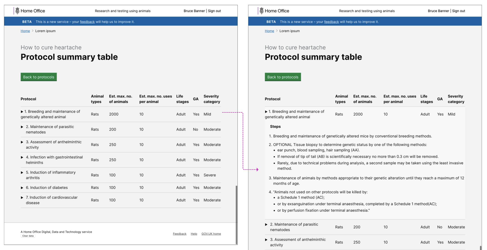

# Summary as of Wednesday 18 March 2020 

# Sprint 54

## Just Done
* Hint text to PPL title to encourage lay titles
* Improvements to PIL landing page content to help users make PIL transfer requests
* PIL review date now shown on PDF
* Update to permission level naming (Personal - basic, Intermediate - overview, Admin - PEL holder delegate)
* ASRU can now search by licence number in Licence fee lists
* New content to all emails for granted/amended licences saying there may be design modifications to the printed licences made in the future as we continue to improve the layout. This won't affect any granted authority

## About to Do/Doing
* User research - rerun the external customer satisfaction survey
* Design PPL assessments for amendments
* Working software - 5 yr PIL review landing page
* Working software - 5 yr PIL review PIL at my establishment list
* Working software - NTS print view

## Bugs Fixed this week
The following bugs were fixed this week.
[Bug Fixes week to Wednesday 18 March 2020](graphs/bugs18032020.png)

We planned the following issues in this sprint 
[Sprint 54](graphs/sprint18032020.png)

## Support tickets and known issues
[Link to Support Board](https://collaboration.homeoffice.gov.uk/jira/secure/RapidBoard.jspa?rapidView=1717&selectedIssue=ASSB-253)

[Support board - cached](graphs/supportBoard18032020.png)

## Click here for metrics / progress against plan
[Sprint 54](graphs/progress18032020.png)

[Post Release Roadmap](graphs/roadmap18032020.png)

Our goals for the previous sprint were:
1. PPL transfer - working software ***\[In Progress\]***
2. Digitise Paper Licences - working software ***\[In Progress\]***
3. Iteration of PPL assessment designs ***\[In Progress\]***

Our goals for the current sprint are:
1. PPL transfers - working software
2. Digitise Paper Licences - working software
3. Content Design - Improvements to Named People assignment 
4. Rerun external user satisfaction survey

## Sample Design Prototypes

 

[Transfer PPL](TransferPPL.md)

## Google Analytics for this report
[Google Analytics](graphs/GA18032020.png)

