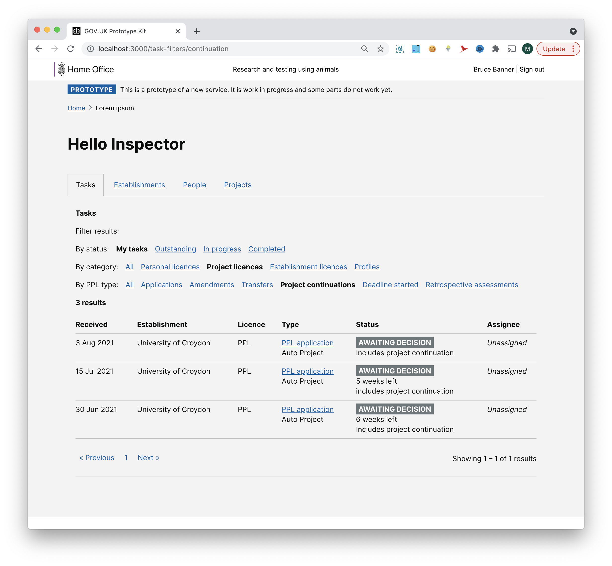

# Summary as of Wednesday 18 August 2021 

# Sprint 91

## Just Done
* TEXT_HERE
* TEXT_HERE
* TEXT_HERE

## About to Do/Doing
* TEXT_HERE
* TEXT_HERE
* TEXT_HERE

## Bugs Fixed this week
The following bugs were fixed this week.
[Bug Fixes week to Wednesday 18 August 2021](graphs/bugs18082021.png)

We planned the following issues in this sprint 
[Sprint 91](graphs/sprint18082021.png)

## Support tickets and known issues
[Link to Support Board](https://collaboration.homeoffice.gov.uk/jira/secure/RapidBoard.jspa?rapidView=1717&selectedIssue=ASSB-253)

[Support board - cached](graphs/supportBoard18082021.png)

## Click here for metrics / progress against plan
[Sprint 91](graphs/progress18082021.png)

[Post Release Roadmap](graphs/roadmap18082021.png)

1) Complete outstanding ROPs issues 2) Review role descriptions for ASRU users - Xenopus

1) Makes ROPs ready for deployment - working software 2) Prepare for technical design authority - whole team 3) Filtering inspectors' tasks - design (Wombat)

## Sample Design Prototypes

 

 

## Google Analytics for this report
[Google Analytics](graphs/GA18082021.png)

