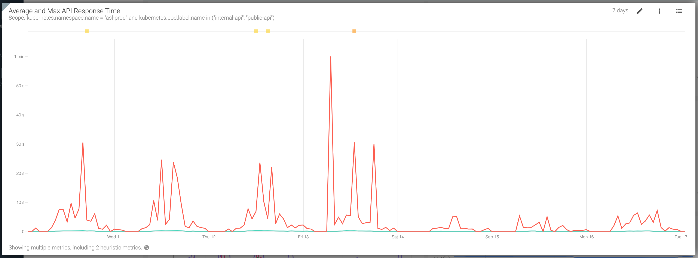

# Summary as of 18th September 2019 

# Sprint 42

## Just Done
* Pdf downloads of granted PILs - working software
* Pdf downloads of granted PELs - working software
* Change PPL licence holder within establishment - working software
* Research on the 5 year PIL review process with establishments and ASRU
* Planned Cat E PIL research
* Task list query optimisation

## About to Do/Doing
* Design - Add training for PPL holder
* Investigate performance of project review page
* 5 year PIL review research findings report
* Cat E PIL prototype testing with establishments

## Things to be aware of
* Improvements in performance

 

## Bugs Fixed this week
The following bugs were fixed this week.
[Bug Fixes w/c 18th September 2019](graphs/bugs18092019.jpg)

We planned the following issues in this sprint 
[Sprint 42](graphs/sprint18092019.png)

## Support tickets and known issues
[Link to Support Board](https://jira.digital.homeoffice.gov.uk/secure/RapidBoard.jspa?rapidView=331&selectedIssue=ALS-47)

[Support board - cached](graphs/supportBoard18092019.jpg)

## Click here for metrics / progress against plan
[Week 1 - Sprint 42 - Release 1](graphs/progress18092019.png)

Our goals for the previous sprint were: 
1. Migrate draft PPL amendments ***[Done]***
2. Deliver print view of PEL & PIL ***[Done]***
3. Service assessment ***[Done]***

Our goals for the sprint are:
1. User Research for Category E PILs 
2. Explore PPL/ PELH approval

## Google Analytics for this report
[Google Analytics](graphs/GA18092019.jpg)

