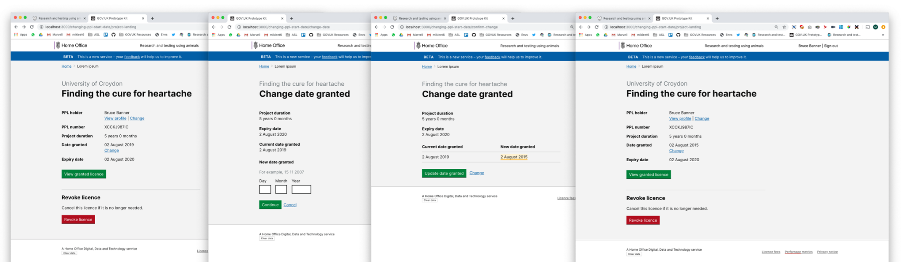

# Summary as of Wednesday 18 December 2019 

# Sprint 48

## Things to bear in mind
* This is a slightly strange sprint because of the Christmas break, the new sprint will start on Wednesday 8th January 2020

## Just Done
* Working software - re-work of notifications to users 
* Testing of 5 year PIL review designs with 3 establishments
* Design - changing a PPLs start date
* PEL Assessment workshop

## About to Do/Doing
* User research - feedback to team findings from 5 year PIL review testing with users
* Desing - add training and education PPL questions
* Working software - PPL compare versions overlay - expance overlay

## Bugs Fixed this week
The following bugs were fixed this week.
[Bug Fixes week to Wednesday 18 December 2019](graphs/bugs18122019.png)

We planned the following issues in this sprint 
[Sprint 48](graphs/sprint18122019.png)

## Support tickets and known issues
[Link to Support Board](https://collaboration.homeoffice.gov.uk/jira/secure/RapidBoard.jspa?rapidView=1717&selectedIssue=ASSB-253)

[Support board - cached](graphs/supportBoard18122019.png)

## Click here for metrics / progress against plan
[Sprint 48](graphs/progress18122019.png)

[Post Release Roadmap](graphs/roadmap18122019.png)

Our goals for the current sprint are:
1. User Research - 5 year PIL review 
2. Development - improve notifications 
3. Design - PPL Improvements

## Sample Design Prototypes

 

## Google Analytics for this report
[Google Analytics](graphs/GA18122019.png)

