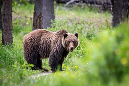

# Summary as of Wednesday 18th December 2024

## Future research and recruitment 

Thank you for your continued involvement in user research for ASPeL– your participation is integral to understanding the user experience. The research on ASPeL features continues. Please contact our user researcher rachel.cholerton@digital.homeoffice.gov.uk to participate. Thank you.  
 

Attribution:
](FairyWren.jpg)

Fun facts about Fairy Wren:
Some species eavesdrop on other birds to determine when predators are nearby.

# Completed Sprint: 151(Fairy Wren)

1) We implemented PIL E improvements which include creating a functionality for: a) detailed course purpose for both Training and Higher   Education, b)mandatory fields, c)hint texts, d)a word count limit on free text fields, and e) making course purpose to display in PIL-E personal licence screen.
2) We created a wordcount component which we can reuse for all ASPeL free text fields 
3) Based on feedback, we simplified the RoP procedure response to 'Yes' or 'No' -on the question-'is this an endangered specie?'
4) We got NACWO and NVS guides published in gov.uk
5) We completed the first iteration of our improvements to Named Persons nominations with - Training record details.
6) We enabled endangered species CSV download on ASPeL
   

   

# Bugs Done or Closed this Sprint
 

# New Sprint: 152(Grizzly Bear)

Attribution:

 
Fun facts about Grizzly Bear: Meriwether Lewis and William Clarke: first described them as grisley, which could be interpreted as either "grizzly" (i.e., "grizzled"—that is, with grey-tipped hair) or "grisly" ("fear-inspiring", now usually "gruesome"). 

## Planned for this Sprint 152 (Grizzly Bear)

1) We will continue work to improve licencing data description for annual reports
2) Continue ASL Schema updates to improve ASPeL internally
3) Continue improvements to the establishments page on Gov.uk 
4) Ensure animals already cited as endangered in RoP are not later deselected by users.
5) Standardise authourisation for rehoming and set free to improve efficiencies in time and effort for users.
6) Continue Named Person improvements 
7) NTS publishing improvements
8) Design a single GA Standard protocol
9) We will insert a link from a Named Person application page to the guides stored on the gov.uk site, for users' convenience.

   

   

## Things to bear in mind
Kindly let us know how we are doing in keeping you informed. We appreciate your feedback on the content of this report. 
We are always looking for external testers for new features on ASPeL, should you be interested, please get in touch using this email. david.utley@homeoffice.gov.uk

Thank you for your support in 2024, enjoy your festive break and looking forward to seeing you all in the New Year!

# Work in progress
1) All outstanding change highlighting errors within ASPeL such as 'changed flag displayed when no change has been made', date validity issues, and data errors. 
  

   
 
   
## Support tickets and known issues
[Link to Support Board](https://collaboration.homeoffice.gov.uk/jira/secure/RapidBoard.jspa?rapidView=1717))

  

The ASPeL team wish you all, the very best of the festive season and a Happy New Year!
