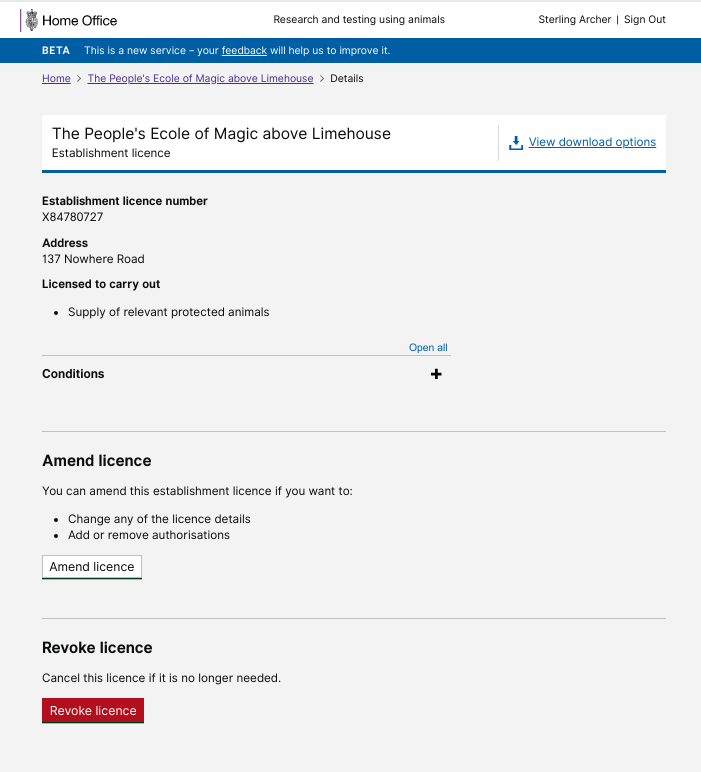
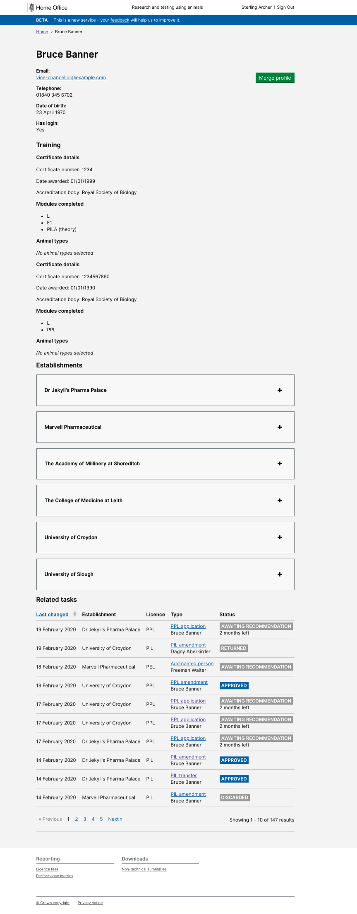

# Summary as of Wednesday 19 February 2020 

# Sprint 52

## Just Done
* 2nd round of user research for inspector assessment 
* Initial designs for assessments, 5 year reviews 
* Exercise mapping the assessment standards to the application form to better align the two
* Improve PPL download options, revoke a PEL

## About to Do/Doing
* 3nd round of user research for inspector assessment
* Iterate designs for assessments
* Digitise legacy paper licences
* Begin work on PPL transfers between establishments

## Bugs Fixed this week
The following bugs were fixed this week.
[Bug Fixes week to Wednesday 19 February 2020](graphs/bugs19022020.png)

We planned the following issues in this sprint 
[Sprint 52](graphs/sprint19022020.png)

## Support tickets and known issues
[Link to Support Board](https://collaboration.homeoffice.gov.uk/jira/secure/RapidBoard.jspa?rapidView=1717&selectedIssue=ASSB-253)

[Support board - cached](graphs/supportBoard19022020.png)

## Click here for metrics / progress against plan
[Sprint 52](graphs/progress19022020.png)

[Post Release Roadmap](graphs/roadmap19022020.png)

Our goals for the previous sprint were:
1. Digitise paper licences - working software ***\[Postponed until next sprint\]***
2. New designs for 5yr PIL review ***\[Second iteration complete\]***
3. Improve content for transfer and amendment of PILs ***\[Done\]***

Our goals for the current sprint are:
1. Digitise Paper Licences 
2. User Research - Inspector assessment 3rd round 
3. Continue Assessment Design work

## Sample Design Prototypes
### Revoke PEL

 
### List of tasks associated with a user

 

## Google Analytics for this report
[Google Analytics](graphs/GA19022020.png)

