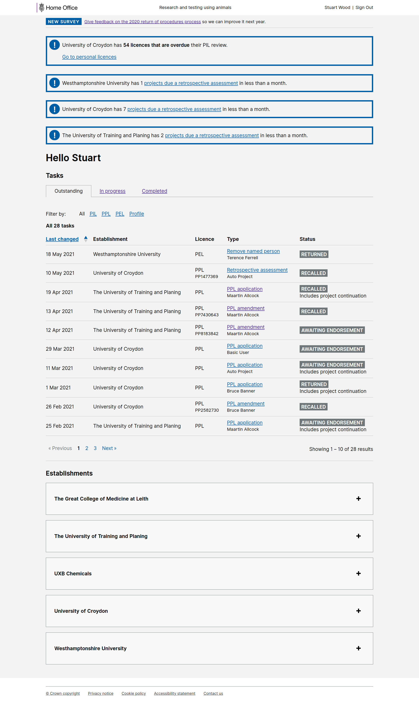

# Summary as of Wednesday 19 May 2021 

# Sprint 84

## Just Done
* Set up user research for PPL rejection journey - user research
* Create discussion guide for testing the PPL refusal journey - user research
* GDPR clean up of old session recordings - user research
* Small RoPs improvements - design
* Prototype for refuse a PPL - design
* Notifications for admins/ppl holder on ppl deadline extension - working software
* Typeahead for places site and area - working software
* Various rops improvements and bugfixes - working software
* Banner showing admins how many RA’s required in next month - working software
* PPL review section navigation - working software

## About to Do/Doing
* Support use of reusable components for steps and protocols - user research
* Test the end to end PPL refusal journey with users - user research 
* Requiring AWERB endorsement on PPL submissions - design
* More RoP improvements - design 
* PEL conditions & authorisations download - working software

## Bugs Fixed this week
The following bugs were fixed this week.
[Bug Fixes week to Wednesday 19 May 2021](graphs/bugs19052021.png)

We planned the following issues in this sprint 
[Sprint 84](graphs/sprint19052021.png)

## Support tickets and known issues
[Link to Support Board](https://collaboration.homeoffice.gov.uk/jira/secure/RapidBoard.jspa?rapidView=1717&selectedIssue=ASSB-253)

[Support board - cached](graphs/supportBoard19052021.png)

## Click here for metrics / progress against plan
[Sprint 84](graphs/progress19052021.png)

[Post Release Roadmap](graphs/roadmap19052021.png)

[Roadmap Visualisaton (Experimental) ](roadmapVisualisation19052021.md)

## Our goals for this sprint were:
1. Plan and prepare testing for "Refuse a PPL" - (design and user research)
2. Improve messaging around RA requirements (Working software) 

## Sample Design Prototypes

 

## Google Analytics for this report
[Google Analytics](graphs/GA19052021.png)

