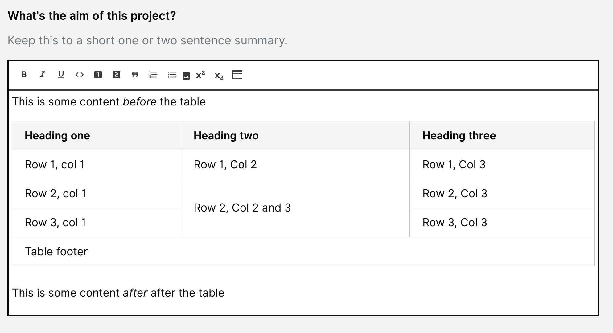

# Summary as of 19th June 2019 

# Sprint 35

## Just Done
* Allow tables to be entered in the rich text editor - working software
* End to end testing with "Halloween data" with  establishments, licensing and inspectors
* Added issues arising from end to end testing to product backlog
* Capturing animal types for PIL applications
* New designer onboarding
* Digital view of the new granted licence - design
* PPL Holder amendment - Establishment view - design

## About to Do/Doing
* Change PPL holder - working software
* Planning for Inspector Roadshow
* Changes to design of view of granted PPL license.
* PPL Holder amendment - ASRU reviews

## Things to be aware of
* Today we will take another copy of the live data AKA "Guatamalan Father's Day" data.

## Click here for Prioritised Road Map
[Prioritised Road Map](https://trello.com/b/p7x9hbPV/prioritised-roadmap)    [\(Cached Image\)](graphs/ASLRoadMap19062019.jpg)

## Click here for metrics / progress against plan
[Sprint 35 - Week 1 - Release 1](graphs/progress19062019.png)

## Burnup Chart

[Burnup Chart](burnup19062019.md)

## Risks
[Links to Project Risks in Trello](https://trello.com/b/VuFuCL7t/risk-register-and-kpis-asl-delivery) 
[Link to Risk Chart](graphs/risk19062019.png)

## Sprint Planning
* We planned the following issues in sprint planning 
[Link to Issues in Jira](https://jira.digital.homeoffice.gov.uk/secure/RapidBoard.jspa?rapidView=261)    [\(Cached Image\)](graphs/sprint19062019.png)

Our goals for the sprint are:
1. Amend PPL holder - dev 
2. Amend establishment details - dev 
3. Plan and conduct ASRU roadshow 
4. Design views of granted PPL licences (digital, print, new, legacy) 

## Screenshots of the PPL application prototype

 

 

## Google Analytics for this report
[Google Analytics](graphs/GA19062019.jpg)

