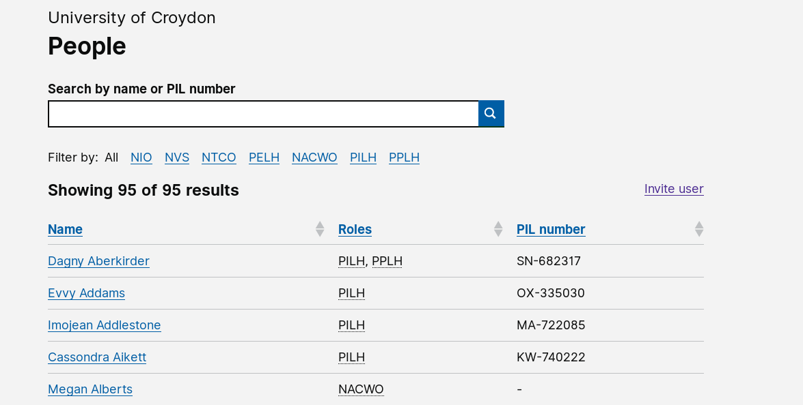

# Summary as of 19th September 2018

# Sprint 17
 
## What's Blocking us / Issues
* We are still experiencing difficulty in reaching agreement on a method of data migration with the suppliers of the existing system

## Just Done
* Compiled a holistic view of all journeys designed to date
* PIL recommendation - validated with Inspectors
* PPL exploratory research with Inspectors
* HO design system migration
* Initial demo of PIL application working software

## About to Do/Doing
* Design the Category DEF PIL application journey
* Begin preliminary work on the PPL application journey
* PPL exploratory research with External Users
* Build workflow framework
* Continue development of PIL application

## Things to be aware of
* New designer has joined the team

## Click here for our High-Level Road map
[Link to Live Road map in Trello](https://trello.com/b/gDQdE01u/asl-roadmap)    [\(Cached Image\)](graphs/ASLRoadMap19092018.jpg)

## Click here for metrics / progress against plan
[Week 1 - Sprint 17 - Release 1](graphs/progress19092018.png)

## Burnup Chart

[Burnup Chart](graphs/burnup19092018.svg)

## Risks
[Links to Project Risks in Trello](https://trello.com/b/VuFuCL7t/risk-register-and-kpis-asl-delivery)    [\(Cached Image\)](graphs/ASLRiskRegister19092018.jpg)

[Risk Management Chart](graphs/risk19092018.png)

## Sprint Planning
* We planned the following issues in sprint planning today [Link to Issues in Jira](https://jira.digital.homeoffice.gov.uk/secure/RapidBoard.jspa?rapidView=261)    [\(Cached Image\)](graphs/sprint19092018.png)

Our goals for the sprint are:
* Conclude PPL Exploration and feedback to team 
* Add named People and PIL DEF 
* PIL Application, Front End 

## Sample Design Prototype
username: holc

password: holc

