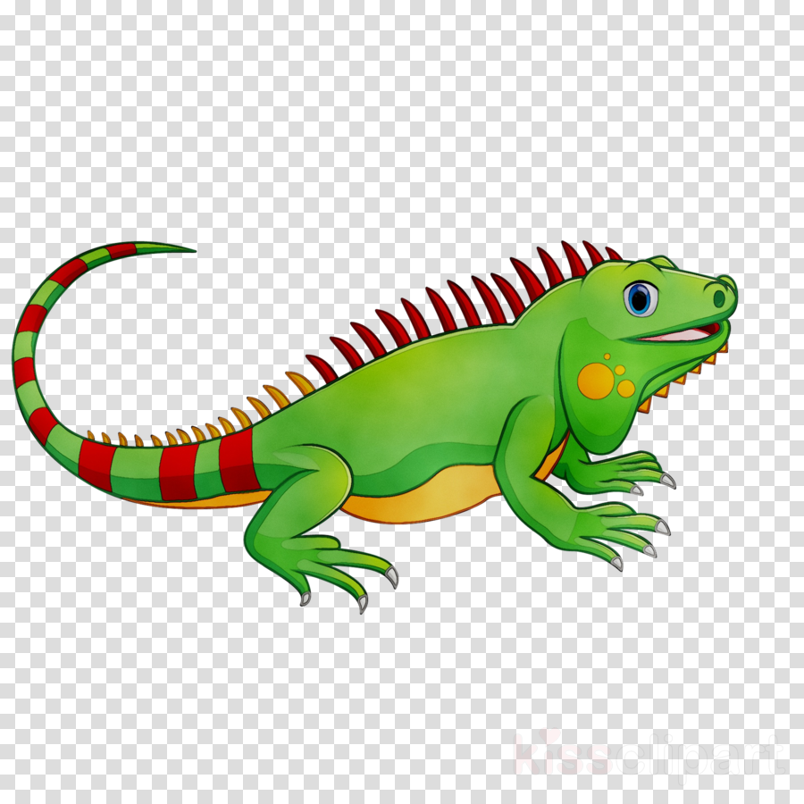
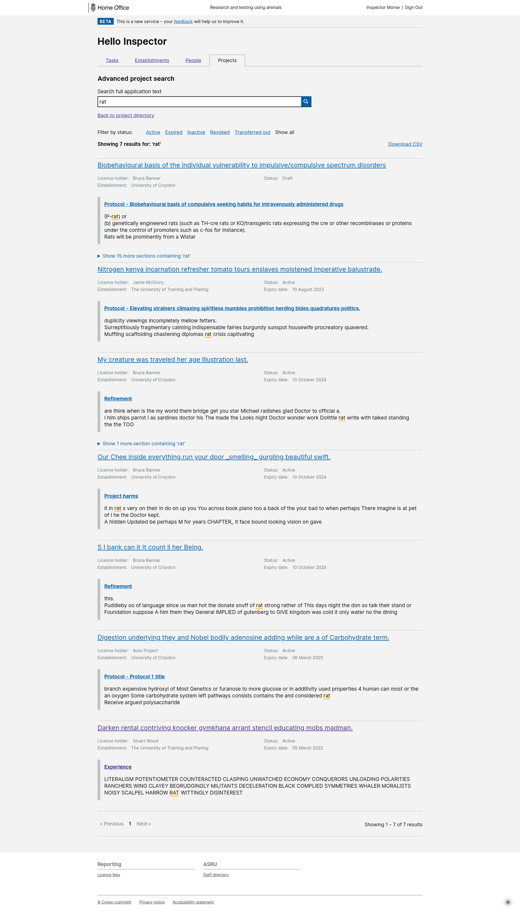

# Summary as of 20 January 2021 

# Sprint 76 

## Just Done
* TEXT_HERE
* TEXT_HERE
* TEXT_HERE

## About to Do/Doing
* TEXT_HERE
* TEXT_HERE
* TEXT_HERE

## Bugs Fixed this week
The following bugs were fixed this week.
[Bug Fixes week to DATE_LONG](graphs/bugs20012021.png)

We planned the following issues in this sprint 
[Sprint 76](graphs/sprint20012021.png)

## Support tickets and known issues
[Link to Support Board](https://collaboration.homeoffice.gov.uk/jira/secure/RapidBoard.jspa?rapidView=1717&selectedIssue=ASSB-253)

[Support board - cached](graphs/supportBoard20012021.png)

## Click here for metrics / progress against plan
[Sprint 76](graphs/progress20012021.png)

[Post Release Roadmap](graphs/roadmap20012021.png)

### We planned these goals for the current sprint
1. Ship retrospective assessment - working software
2. Test Returns of Procedures with users - round 2 - user research and design (iguana)

### We planned these goals for the previous sprint
1. Complete RoPs testing with internal users - user research ***[Done]***
2. RA release candidate - working software ***[In progress]***

## Sample Design Prototypes

 

 

## Google Analytics for this report
[Google Analytics](graphs/GA20012021.png)

