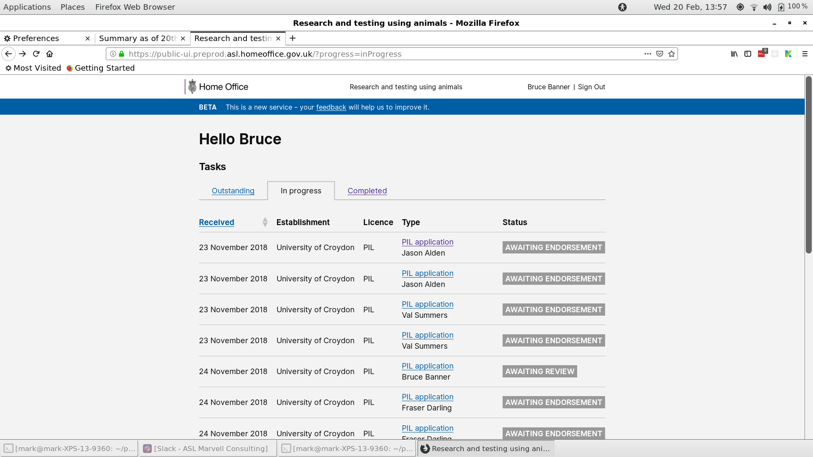
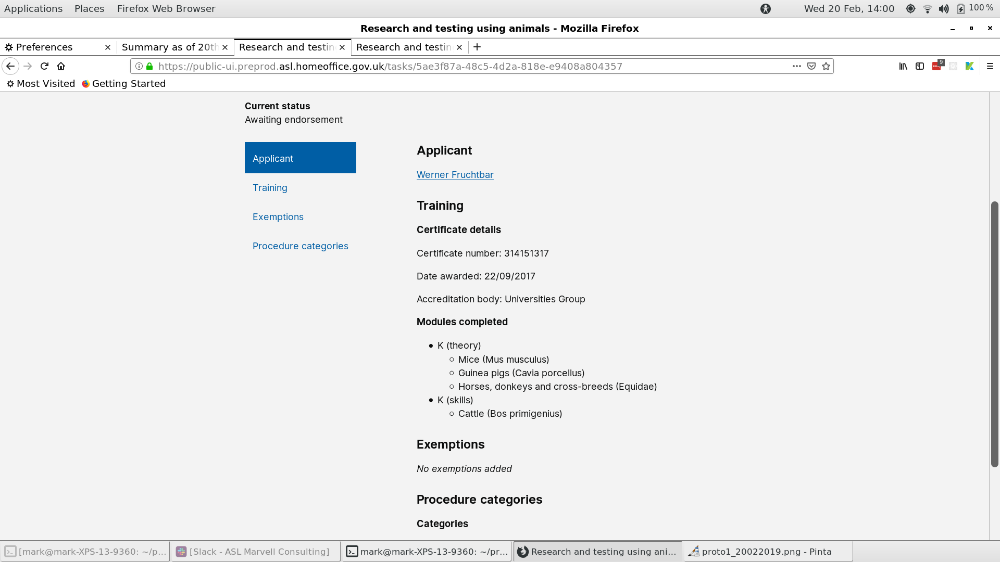

# Summary as of 20th February 2019 

## Sprint 27

## Just Done
* Demonstrated working software for application and grant of PIL workflow
* User research with establishment users and Inspectors on review process for PPL applications
* Preparation for final Alpha service assessment

## About to Do/Doing
* We have our initial Technical Design Authority meeting on Thursday 21 Feb
* Development of working software for notifications and project application submission
* Design of Project licence granting process
* Exploration of the legacy PPL amendment lifecycle

## Things to be aware of
* We've been assigned a security specialist to help us obtain all required assurances and authorisations

## Click here for Prioritised Road Map
[Prioritised Road Map](https://trello.com/b/p7x9hbPV/prioritised-roadmap)    [\(Cached Image\)](graphs/ASLRoadMap20022019.jpg)

## Click here for metrics / progress against plan
[Week 1 - Sprint 27 - Release 1](graphs/progress20022019.png)

## Burnup Chart
[Burnup Chart](burnup20022019.md)

## Risks
[Links to Project Risks in Trello](https://trello.com/b/VuFuCL7t/risk-register-and-kpis-asl-delivery) 
 
[Link to Risk Chart](graphs/risk20022019.png)

## Sprint Planning
* We planned the following issues in sprint planning today [Link to Issues in Jira](https://jira.digital.homeoffice.gov.uk/secure/RapidBoard.jspa?rapidView=261)    [\(Cached Image\)](graphs/sprint20022019.png)

Our goals for the previous sprint were:
* Carry out PPL review research with inspectors and establishment user
**[Done]**
* Prepare for service assessment
**[Done]**
* Release PPL drafting tool to establishments
**[Done]**
* Get ASRU users to log into the system
**[In Progress]**

Our goals for the sprint are:
* Project Application Submission 
* Send notification emails 
* Legacy PPL amendment lifecycle 
* Test University of Croydon with Licensing Officers 
* Design granting PPL

## Screenshots of the PPL application prototype

 

 

## Google Analytics for this report

This shows:
* total number of users
* number of new users

[Google Analytics](graphs/GA20022019.jpg)

