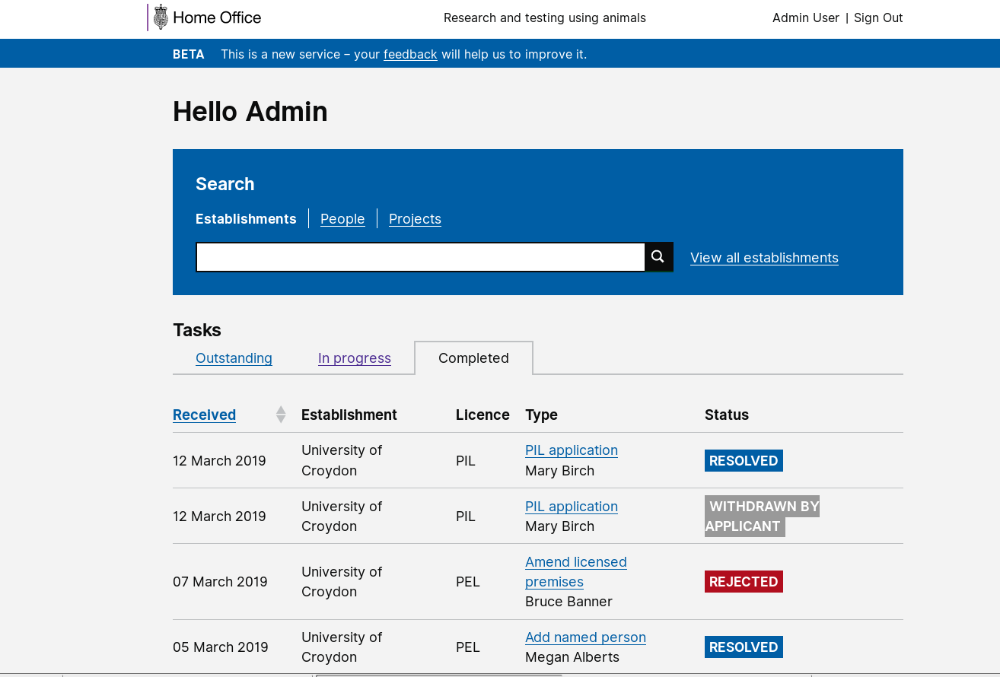
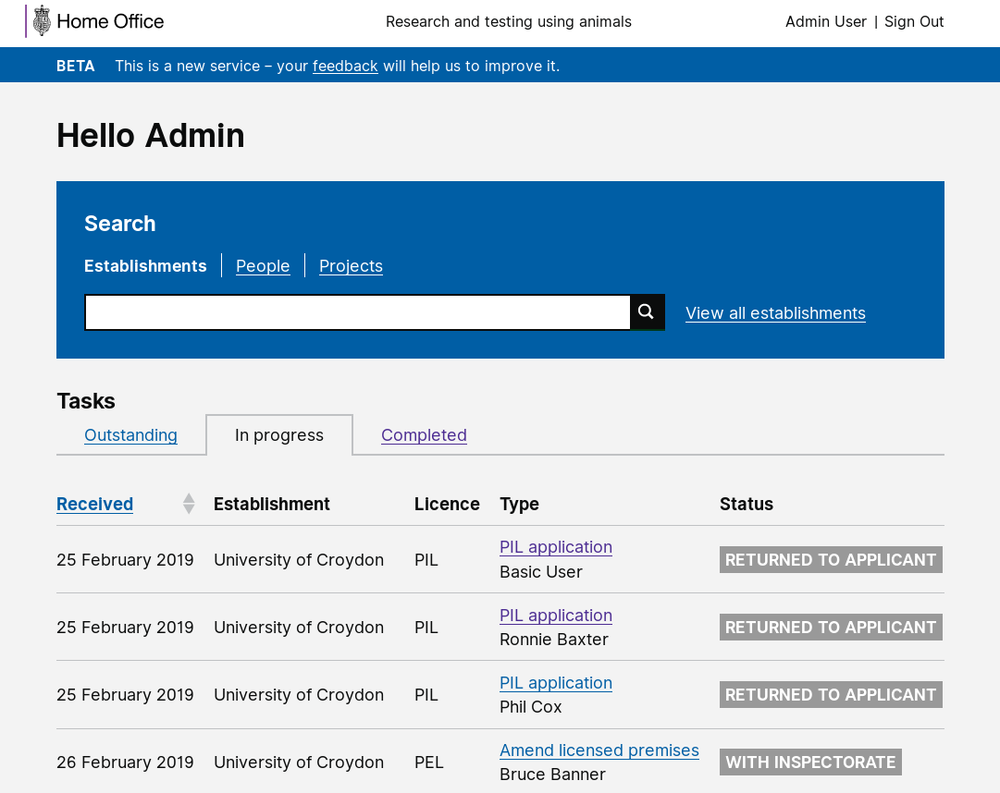

# Summary as of 20th March 2019

# Sprint 29
 
## What's Blocking us / Issues
* We are encoutering some issues with data migration/cleaning which we are working through 

## Just Done
* Notifications
* Project protocol refactor
* Data migration - PEL

## About to Do/Doing
* Workshops with establishments on the view of the PPL
* Data migration PIL and PPL
* Working software ASRU establishment assignment
* Working software - a read view of legacy PPLs

## Things to be aware of
* Members of the team will present at the ASRU conference 

## Click here for Prioritised Road Map
[Prioritised Road Map](https://trello.com/b/p7x9hbPV/prioritised-roadmap)    [\(Cached Image\)](graphs/ASLRoadMap20032019.jpg)

## Click here for metrics / progress against plan
[Week 1 - Sprint 29 - Release 1](graphs/progress20032019.png)

## Burnup Chart

[Burnup Chart](burnup20032019.md)

## Risks
[Links to Project Risks in Trello](https://trello.com/b/VuFuCL7t/risk-register-and-kpis-asl-delivery) 
[Link to Risk Chart](graphs/risk20032019.png)

## Sprint Planning
* We planned the following issues in sprint planning today [Link to Issues in Jira](https://jira.digital.homeoffice.gov.uk/secure/RapidBoard.jspa?rapidView=261)    [\(Cached Image\)](graphs/sprint20032019.png)

Our goals for the previous sprint were:
* Data Migration
***[In progress]***
* Legacy PPLs Skeleton Design
***[Done]***
* Granting PPLs - Design
***[In progress]***
* Split PPL Review into separate Chunks
***[In progress]***
* Licensing Officer - test working software
***[Done]***
* Plan research view of licence
***[Done]***

Our goals for the sprint are:
1. Read view of legacy PPLs 
2. ASRU Establishment Assignment 
3. Explore view of PPL licence data with establishments 
4. Complete designs for granting PPLs

## Screenshots of the PPL application prototype

 

 

## Google Analytics for this report

This shows:
* total number of users
* number of new users

[Google Analytics](graphs/GA20032019.jpg)

