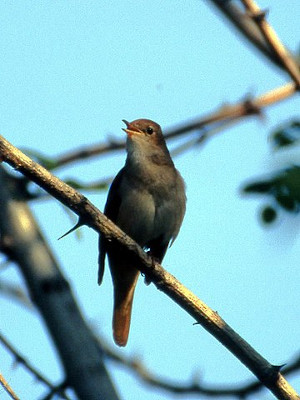
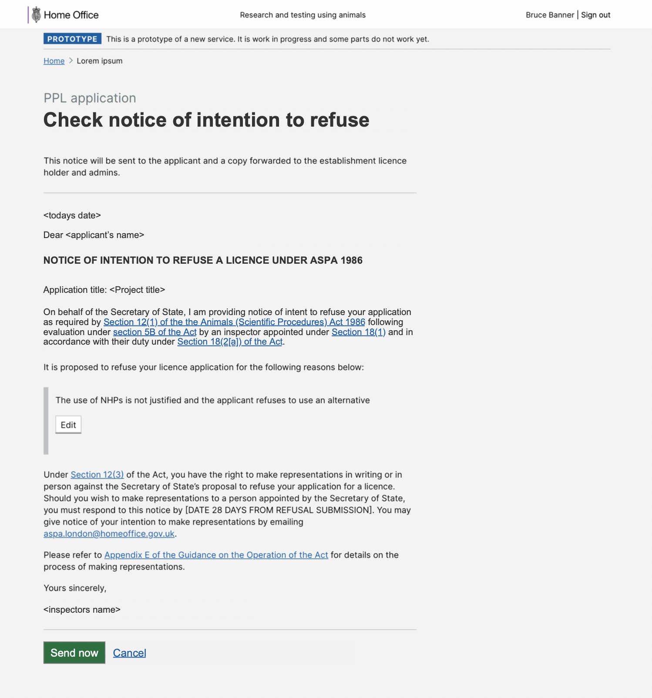

# Summary as of Wednesday 20 April 2022 

# Sprint 107 (Nightingale)

## Just Done
* finalised content and designs for intending to refuse a PPL and setting time based conditions  - design
* create enforcement cases - working software
* add / edit / remove enforcement flags - working software

## About to Do/Doing
* reviewing potential improvement opportunities to PPL protocols - design
* initial exploration into suspending licences - design
* display enforcement flags on licences - working software
* display enforcement flags on tasks - working software

## Bugs Fixed this week
The following bugs were fixed this week.
[Bug Fixes week to Wednesday 20 April 2022](graphs/bugs20042022.png)

We planned the following issues in this sprint 
[Sprint 107](graphs/sprint20042022.png)

## Support tickets and known issues
[Link to Support Board](https://collaboration.homeoffice.gov.uk/jira/secure/RapidBoard.jspa?rapidView=1717&selectedIssue=ASSB-253)

[Support board - cached](graphs/supportBoard20042022.png)

## Click here for metrics / progress against plan
[Sprint 107](graphs/progress20042022.png)

[Post Release Roadmap](graphs/roadmap20042022.png)

1. Start to understand requirements for service handover ***[Done]***
2. Enforcement flags release candidate - working software  ***[In progress]***
3. Initial exploration - suspend a PPL - design ***[In progress]***

PREVIOUS_SPRINT_GOALS

## Sample Design Prototypes
### Refuse a PPL

 

## Google Analytics for this report
[Google Analytics](graphs/GA20042022.png)

