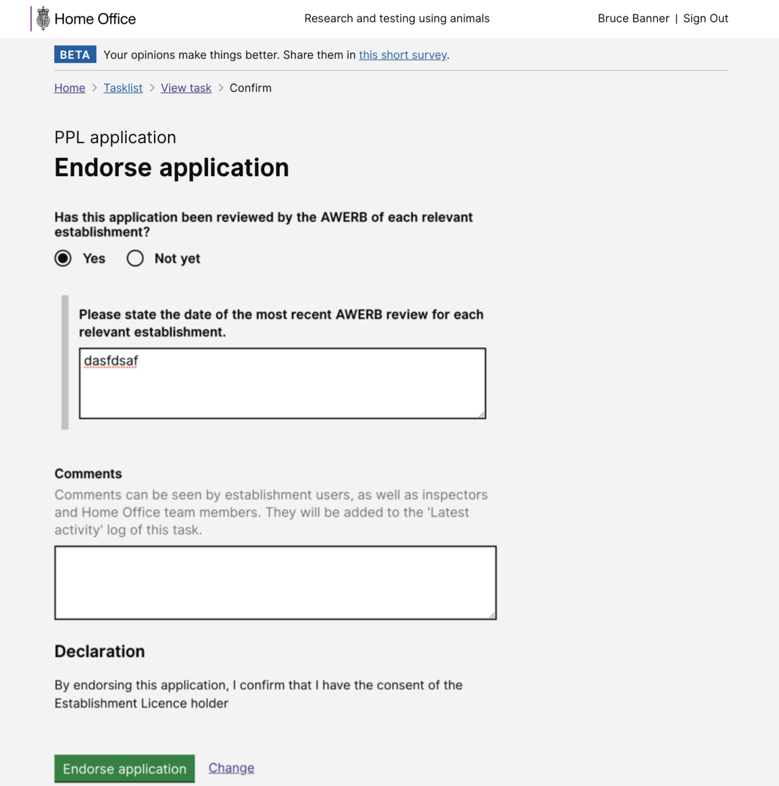
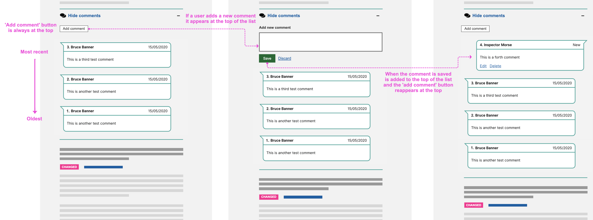

# Summary as of Wednesday 20 May 2020 

# Sprint 58

## Just Done
* Multiple named people assignments on approved areas - working software
* Session timeout improvements when reviewing PPLs - working software
* Content for designs that will allow users to add training and exemptions in ASPeL
* PEL holder delegate makes the AWERB declaration for PPL applications - design
* Reversing the order of comments on PPL applications - design
* Improving how we manage users' training and exemptions - design
* Set up research for "edge case" Cat E PIL - user research 
## About to Do/Doing
* Full PPL application as a PDF document - working software
* Guidance to help ASRU admins understand what licensing, inspector, admin and business support roles can do in ASPeL - content design 
* Cat E PILs iteration and managing the edge case journeys - design
* Plan user research for testing training profiles with ASRU users and with establishments

## Bugs Fixed this week
The following bugs were fixed this week.
[Bug Fixes week to Wednesday 20 May 2020](graphs/bugs20052020.png)

We planned the following issues in this sprint 
[Sprint 58](graphs/sprint20052020.png)

## Support tickets and known issues
[Link to Support Board](https://collaboration.homeoffice.gov.uk/jira/secure/RapidBoard.jspa?rapidView=1717&selectedIssue=ASSB-253)

[Support board - cached](graphs/supportBoard20052020.png)

## Click here for metrics / progress against plan
[Sprint 58](graphs/progress20052020.png)

[Post Release Roadmap](graphs/roadmap20052020.png)

Our goals for the current sprint are:
1. Conduct training profile user research 
2. Design - Cat E applications for existing PIL holders 
3. Development PPL application download as pdf

## Sample Design Prototypes

 

 

## Google Analytics for this report
[Google Analytics](graphs/GA20052020.png)

