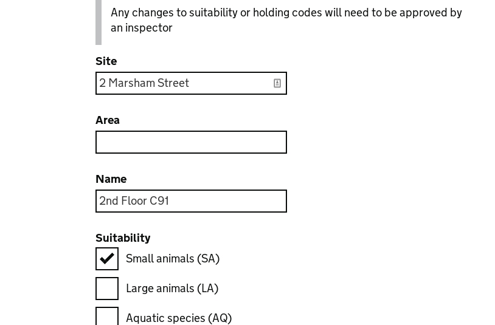

# Summary as of 20th June 2018 
## What's Blocking us / Issues
* Data migration continues to be the biggest issue affecting the speed of progress of the project but this is being address through a process of appliction for authority to operate (ATO) 

## Just Done
* Submitted application for authority to operate (ATO)
* User Experience "surgery" for inbox design (Inspectors) and amendments journey.
* Preparations for the meeting with establishmeht users at the end of the month

## About to Do/Doing
* Run large showcase of existing software, designs and conduct research sessions with up to 40 establishment users
* User research with inspectors: inspectors recommendations for PEL amendments and inspector's inbox
* Develop working software for add a room and remove a room from the schedule of premises on the establishment licence

## Things to be aware of
* The team have received the output from the Alpha service assessment
## Click here for our High-Level Road map
[Link to Live Road map in Trello](https://trello.com/b/gDQdE01u/asl-roadmap)    [\(Cached Image\)](graphs/ASLRoadMap20062018.jpg)

## Click here for metrics / progress against plan
[Week 2 - Sprint 10 - Release 1](graphs/progress20062018.png)

## Risks
[Links to Project Risks in Trello](https://trello.com/b/VuFuCL7t/risk-register-and-kpis-asl-delivery)    [\(Cached Image\)](graphs/ASLRiskRegister20062018.jpg)

[Risk Management Chart](graphs/risk20062018.png)

## Sprint Planning
* We planned the following issues in sprint planning today [Link to Issues in Jira](https://jira.digital.homeoffice.gov.uk/secure/RapidBoard.jspa?rapidView=261)    [\(Cached Image\)](graphs/sprint20062018.png)

Our Goals for the Sprint are:
* Develop working software for add/remove room from external users
* Design iterations of inbox and amendment journeys for all views
* User research with inspectors for add a room as part of amending an establishment licence
* Prepare for meeting with establishment users on 28th June

## Sample Design Prototypes
* Links to demonstrated working software:

Username: holc

Password: holc

Username: inspector

Password: inspector

