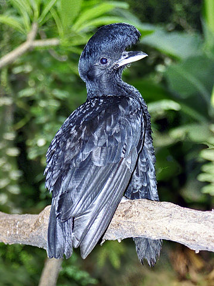
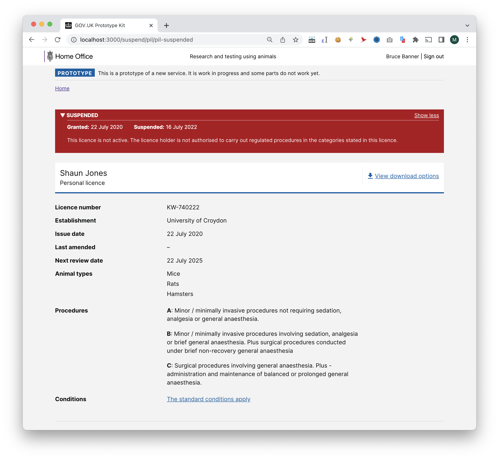

# Summary as of Wednesday 20 July 2022 

# Sprint 114 (Umbrella bird)

## Just Done
* Designs for suspending licences (pending confirmation from ASRU on banner wording)  
* Migrate to new infrastructure for storing images in PPLs
* Write migration script for existing images in PPLs
* Add reminders for upcoming ROPs submissions - working software
* Add reminders for licence conditions with deadlines - working software

## About to Do/Doing
* Writing up developer specifications for suspending licences and reusable steps - design
* Reject a PPL - working sofware
* Change process for marking a PPL application as complete and correct - working software
* Migrate existing PPL versions with images to new infrastructure - working software

## Bugs Fixed this week
The following bugs were fixed this week.
[Bug Fixes week to Wednesday 20 July 2022](graphs/bugs20072022.png)

We planned the following issues in this sprint 
[Sprint 114](graphs/sprint20072022.png)

## Support tickets and known issues
[Link to Support Board](https://collaboration.homeoffice.gov.uk/jira/secure/RapidBoard.jspa?rapidView=1717&selectedIssue=ASSB-253)

[Support board - cached](graphs/supportBoard20072022.png)

## Click here for metrics / progress against plan
[Sprint 114](graphs/progress20072022.png)

[Post Release Roadmap](graphs/roadmap20072022.png)

### We set these areas of focus for this sprint
1. Release refuse a PPL - working software
2. Design specifications for reusable steps 
3. HOCS Audit

### These were the areas of focus for the previous sprint
1. Designs for suspend a licence ***[Done]***
2. Release time based conditions ***[In progress]***
3. Migrate images out of PPL versions ***[In progress]***

## Sample Design Prototypes
### Example 'suspended PIL' banner (final wording to be confirmed by ASRU)

 

## Google Analytics for this report
[Google Analytics](graphs/GA20072022.png)

