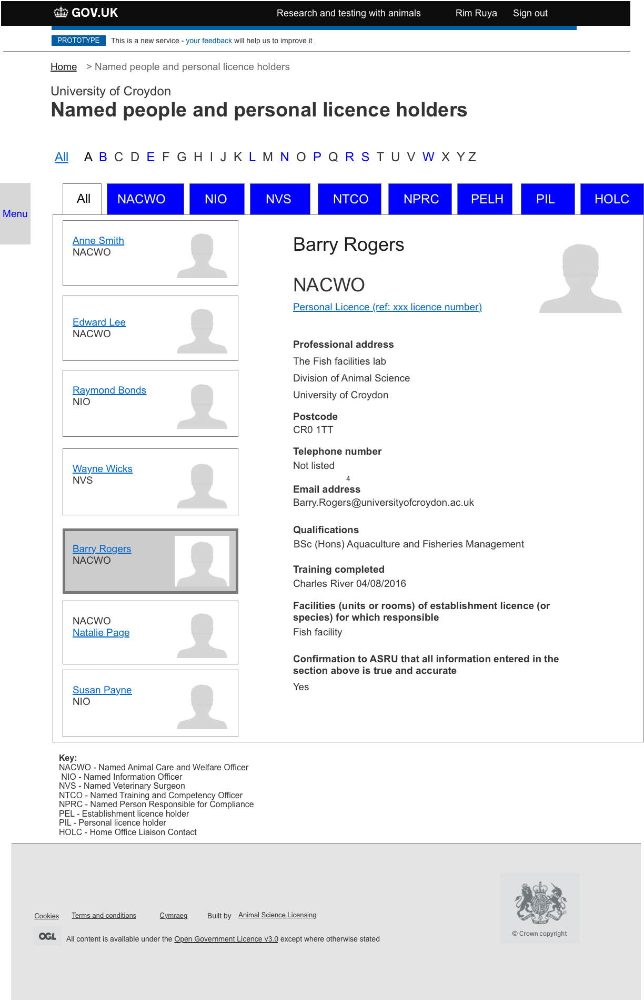
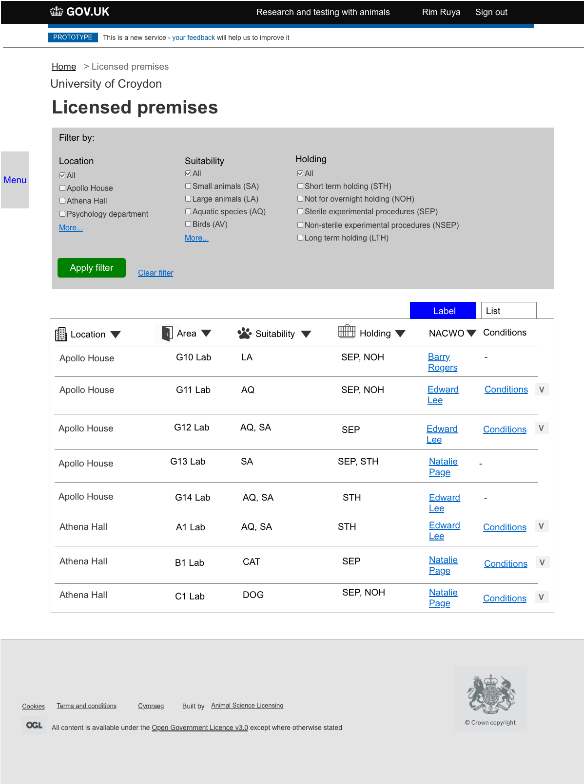

# Summary as of 21st March 2018 
## What's Blocking Us / Issues
* Two members of the team do not have security clearance, this makes having meetings in Lunar house and other Home Office establishments more difficult to arrange
* We have learned that new members of the team require security clearance before they can be given a Home Office digital email account

## Just Done
* Presented roadmap to ASRU leadership team
* Reviewed KPIs with service owner
* Export any page of the prototype to a PDF document
* Summarised research findings and presented at show and tell
* Continued research inspectors view of animal licensing

## About to Do/Doing
* User studies using prototypes with HOLCs: view establishment details
* PDFs of sorted and filtered establishment data

## Things to be aware of
* Two new team members will join next week, an interation designer and a software developer

## Click here for our High-Level Road map
[Link to Live Road map in Trello](https://trello.com/b/gDQdE01u/asl-roadmap)    [\(Cached Image\)](graphs/ASLRoadMap21032018.jpg)

## Click here for metrics / progress against plan
[Week 1 - Sprint 4 - Release 1](graphs/progress21032018.png)

## Risks
[Links to Project Risks in Trello](https://trello.com/b/VuFuCL7t/risk-register-and-kpis-asl-delivery)    [\(Cached Image\)](graphs/ASLRiskRegister21032018.jpg)

[Risk Management Chart](graphs/risk21032018.png)

## Sprint Planning
We planned the following issues in sprint planning today [Link to Issues in Jira](https://jira.digital.homeoffice.gov.uk/secure/RapidBoard.jspa?rapidView=261)    [\(Cached Image\)](graphs/sprint21032018.jpg)
Our three goals for the sprint are
* Explore Establishment Licence Details
* Validate Changes to the Prototype as a Result of Research Findings
* PDFs of sorted and filtered establishment data

## Design Prototypes
[Named People Detail](graphs/People.png)

[Filtered Premises](graphs/LicencedPremises.png)

## Working Software Prototypes
* Log in to this [technical prototype](https://public-ui.notprod.asl.homeoffice.gov.uk/) with username "holc" and password "holc" to see a prototype which allows pages to be rendered at pdf

