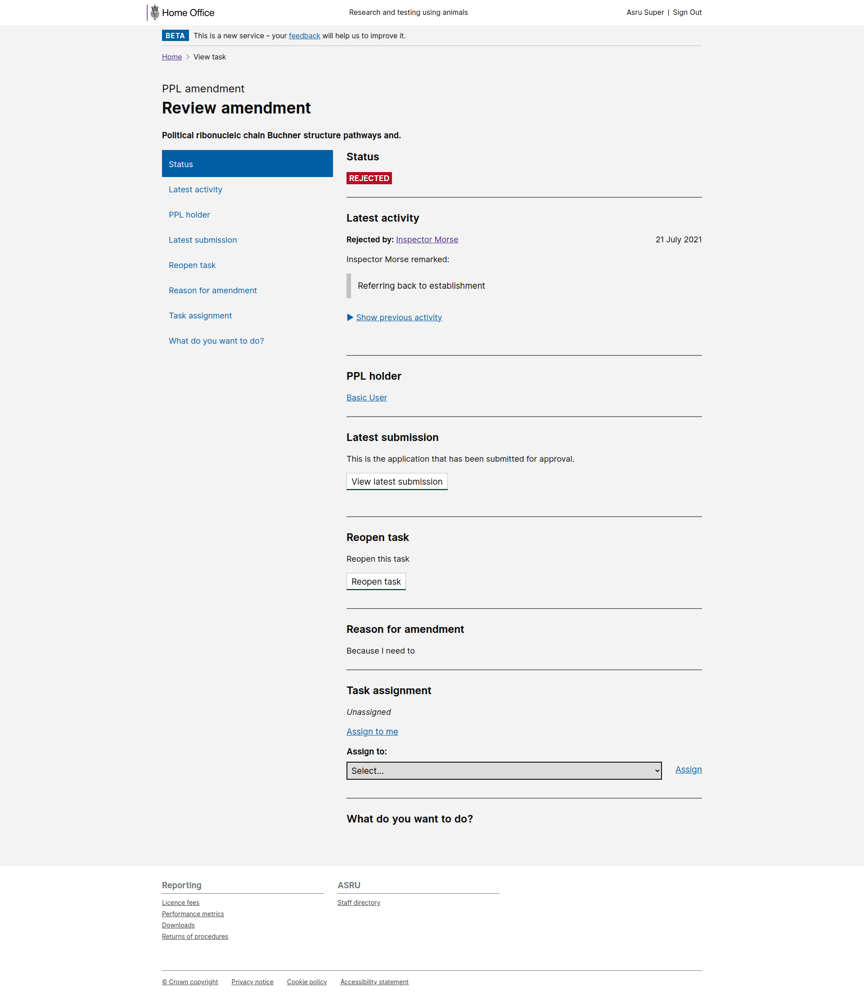
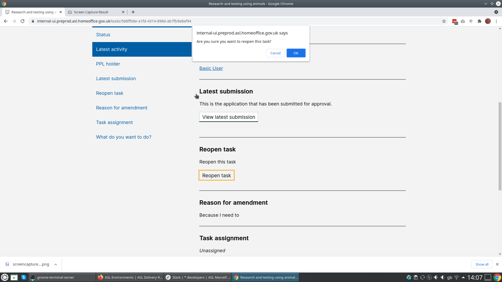
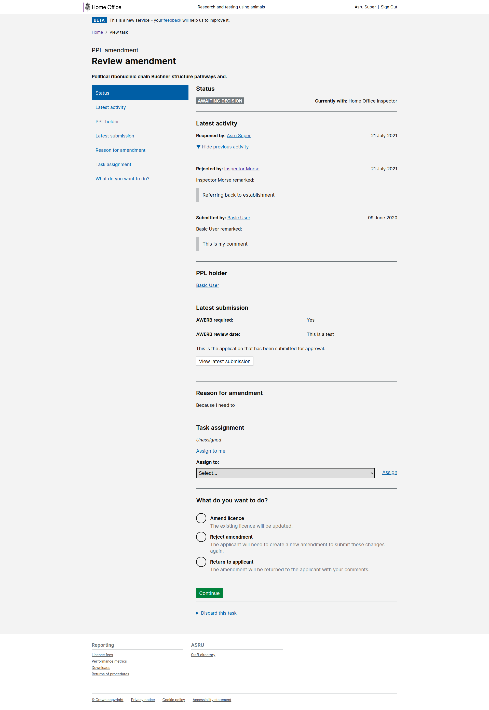

# Summary as of Wednesday 21 July 2021 

# Sprint 89 - Velociraptor

## Weekly summary
* A new product manager has joined the team.
* We have continued to fix issues that have been identified with ROPs and have updated the stats team on progress.
* We have made some changes to our ways of working (show and tell, backlog refinement, support board).

## Just Done
* Tested the reusable steps designs with two inspectors (user research)
* Initial designs for inspectors review of repeated steps (design) 
* Start exploring small design improvements to reduce scrolling and improve navigation in PPLs (content design)
* Addressing known issues with ROPs (working software)
* Fixed bug with rejected projects (working software)
* Made rejected projects recoverable (working software)

## About to Do/Doing
* Documenting the findings from the 2020-21 inspector feedback review to inform the roadmap (user research)
* Minor design improvements to RoPs (design)
* Continuing to address further issues arising from ROPs roll-out (working software)

## Bugs Fixed this week
The following bugs were fixed this week.
[Bug Fixes week to Wednesday 21 July 2021](graphs/bugs21072021.png)

We planned the following issues in this sprint 
[Sprint 89](graphs/sprint21072021.png)

## Support tickets and known issues
[Link to Support Board](https://collaboration.homeoffice.gov.uk/jira/secure/RapidBoard.jspa?rapidView=1717&selectedIssue=ASSB-253)

[Support board - cached](graphs/supportBoard21072021.png)

## Click here for metrics / progress against plan
[Sprint 89](graphs/progress21072021.png)

[Post Release Roadmap](graphs/roadmap21072021.png)

## We set the following goals for this sprint
1. Address all known Return of procedures issues (working software) 
2. Test reusable steps components with inspectors (user research) 
3. Design option for improving task views for ASRU (design) Velociraptor

## These were the goals for the previous sprint
1. Prepare for testing of reusable steps with inspectors (research and design) ***[Done]***
2. Resolution of ROPs issues raised by stats team (working software) ***[In progress]***

## Screenshots of new working software
### Recover a PPL amendment which has been rejected

 

 

 

## Google Analytics for this report
[Google Analytics](graphs/GA21072021.png)

