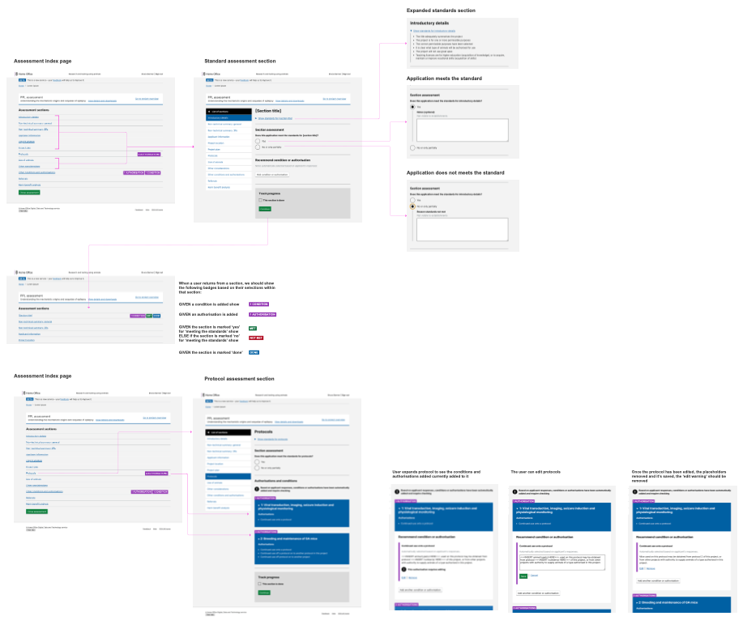

# Summary as of Wednesday 21 October 2020 

# Sprint 69

## Just Done
* TEXT_HERE
* TEXT_HERE
* TEXT_HERE

## About to Do/Doing
* TEXT_HERE
* TEXT_HERE
* TEXT_HERE

## Bugs Fixed this week
The following bugs were fixed this week.
[Bug Fixes week to Wednesday 21 October 2020](graphs/bugs21102020.png)

We planned the following issues in this sprint 
[Sprint 69](graphs/sprint21102020.png)

## Support tickets and known issues
[Link to Support Board](https://collaboration.homeoffice.gov.uk/jira/secure/RapidBoard.jspa?rapidView=1717&selectedIssue=ASSB-253)

[Support board - cached](graphs/supportBoard21102020.png)

## Click here for metrics / progress against plan
[Sprint 69](graphs/progress21102020.png)

[Post Release Roadmap](graphs/roadmap21102020.png)

Sprint Broccoli 1) Release category E PILs - working software 2) PPL version control - design and content 3) Summary of findings for returns of procedures - user research

1) Test PPL assessments with inspectors - user research and design

## Sample Design Prototypes

 

 

## Google Analytics for this report
[Google Analytics](graphs/GA21102020.png)

