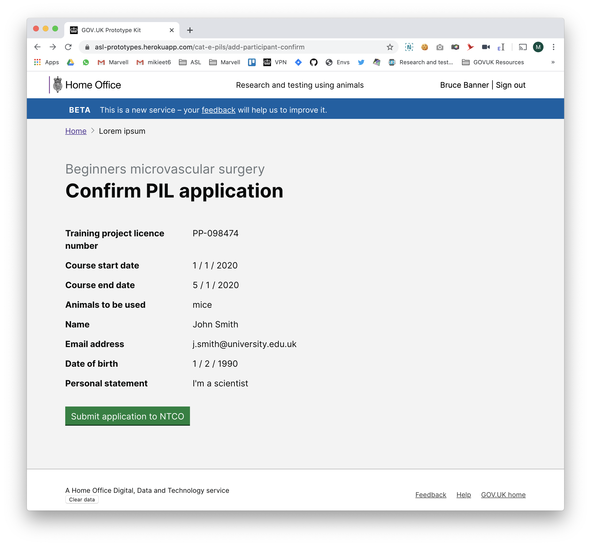

# Summary as of Wednesday 22 April 2020 

# Sprint 56

## Just Done
* TEXT_HERE
* TEXT_HERE
* TEXT_HERE

## About to Do/Doing
* TEXT_HERE
* TEXT_HERE
* TEXT_HERE

## Bugs Fixed this week
The following bugs were fixed this week.
[Bug Fixes week to Wednesday 22 April 2020](graphs/bugs22042020.png)

We planned the following issues in this sprint 
[Sprint 56](graphs/sprint22042020.png)

## Support tickets and known issues
[Link to Support Board](https://collaboration.homeoffice.gov.uk/jira/secure/RapidBoard.jspa?rapidView=1717&selectedIssue=ASSB-253)

[Support board - cached](graphs/supportBoard22042020.png)

## Click here for metrics / progress against plan
[Sprint 56](graphs/progress22042020.png)

[Post Release Roadmap](graphs/roadmap22042020.png)

Our goals for the current sprint are:
1. Set up PIL E Research 
2. Design - Prototype PIL E user journey 
3. Agree approach for Training and Education PPLs

## Sample Design Prototypes

 

## Google Analytics for this report
[Google Analytics](graphs/GA22042020.png)

