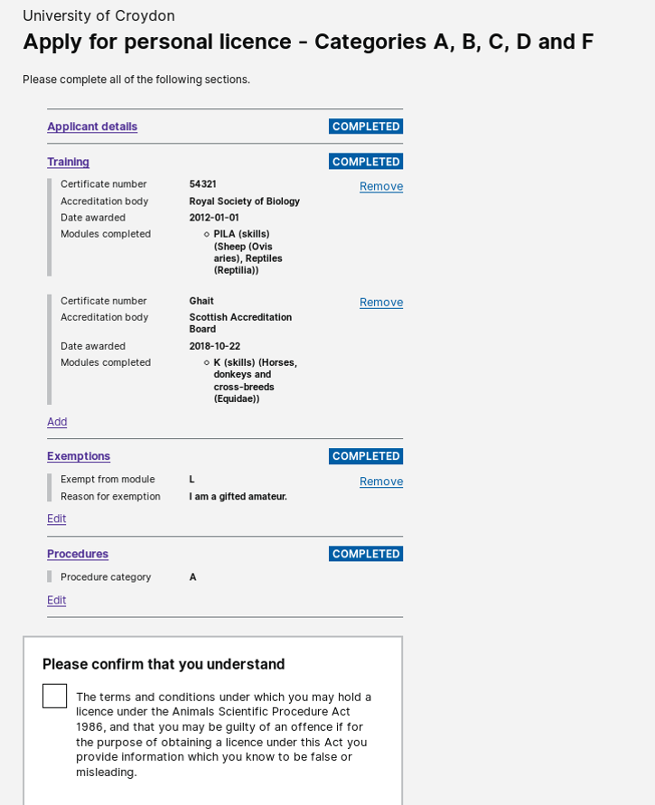
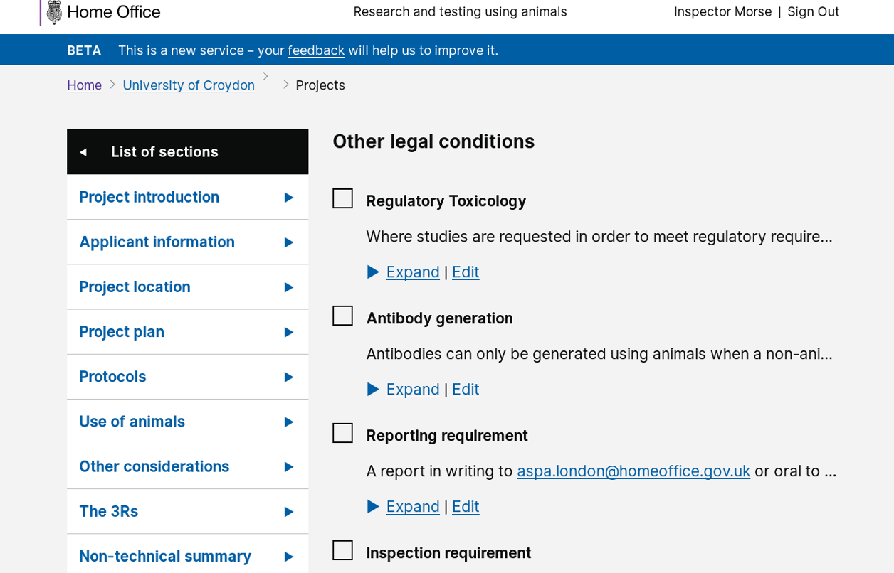

# Summary as of 22nd May 2019 

# Sprint 33

## Just Done
* Amend PIL - working software
* Add "other legal text"
* Tested working software with "Halloween data" with establishment users
* Print view of the New granted licence
* Digital view of the New granted licence
* Project landing page for views of granted licence

## About to Do/Doing
* Testing working software with Inspectors at ASRU conference
* Fix breadcrumb issues
* Testing the digital and print views of the granted licence with establishment users and inspectors 

## Things to be aware of
* The IT Health check is currently in progress 

## Click here for Roadmap
[Roadmap](graphs/HumanFontReleasePlan22052019.png)

## Click here for metrics / progress against plan
[Week 1 - Sprint 33 - Release 1](graphs/progress22052019.png)

## Burnup Chart

[Burnup Chart](burnup22052019.md)

## Risks
[Links to Project Risks in Trello](https://trello.com/b/VuFuCL7t/risk-register-and-kpis-asl-delivery) 
[Link to Risk Chart](graphs/risk22052019.png)

## Sprint Planning
* We planned the following issues in sprint planning [Link to Issues in Jira](https://jira.digital.homeoffice.gov.uk/secure/RapidBoard.jspa?rapidView=261)    [\(Cached Image\)](graphs/sprint22052019.png)

Our goals for the sprint are:
1. Test views of granted PPL 
2. Test Non-UGC at ASRU conference 
3. Working software PIL amendments 
4. Design PIL and PEL conditions and authorisations 
5. Design views of granted licence

## Screenshots working software 

 

 

## Google Analytics for this report
[Google Analytics](graphs/GA22052019.jpg)

