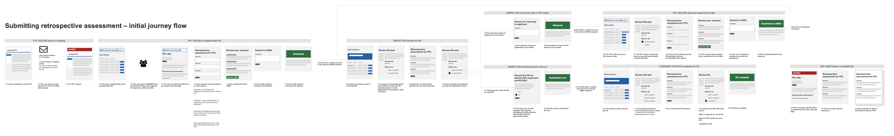

# Summary as of Wednesday 22 July 2020 

# Sprint 63

## Just Done
* Implement change password - working software
* Show remaining role holders in remove named role task page - working software
* Fix changed labels in legacy PPL animal types sections - working software
* Change default search engine to new search infrastructure - working software
* Journey map for submitting an RA - design
* Discussion guide for RA research with establishments and ASRU users - user research
* Held RA session with two admin users from an academic establishment and a commercial establishment - user research

## About to Do/Doing
* Release training and education PPLs - working software
* Rebuild training certificate and exemption UI - working software
* Changes to PPL endorsement functionality - working software
* Show RA flags in project lists - working software
* Improvements to performance dashboard - design
* Prototyping the 'Submit an RA journey' - design
* Holding RA sessions with establishment users and ASRU - user research

## Bugs Fixed this week
The following bugs were fixed this week.
[Bug Fixes week to Wednesday 22 July 2020](graphs/bugs22072020.png)

We planned the following issues in this sprint 
[Sprint 63](graphs/sprint22072020.png)

## Support tickets and known issues
[Link to Support Board](https://collaboration.homeoffice.gov.uk/jira/secure/RapidBoard.jspa?rapidView=1717&selectedIssue=ASSB-253)

[Support board - cached](graphs/supportBoard22072020.png)

## Click here for metrics / progress against plan
[Sprint 63](graphs/progress22072020.png)

[Post Release Roadmap](graphs/roadmap22072020.png)

## These are the goals for the current sprint:

1. Design and Content - Prototype for submission of a retrospective assessment 
2. Working Software - Training profiles 
3. User Research - complete prototype testing for RA submission

## These were the goals for the previous sprint:

1. User needs research for retrospective assessments ***[In Progress]***
2. Design and content - improvements to the performance metrics page ***[In Review]***
3. Working software - change password ***[Done]***

## Sample Design Prototypes

 

## Google Analytics for this report
[Google Analytics](graphs/GA22072020.png)

