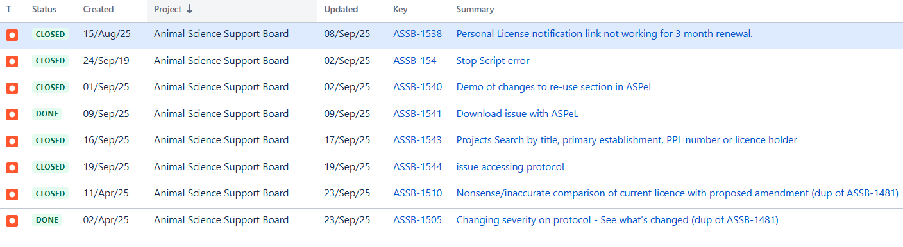

# Summary as of Wednesday 22nd October 2025

## Future research and recruitment 

Thank you for your continued involvement in user research for ASPeL– your participation is integral to understanding the user experience. The research on ASPeL features continues. Please contact our user researcher grace.shaba@homeoffice.gov.uk to participate. Thank you.  
 
# Sprint: 162(quetzal)

Attribution:

Interesting facts about quetzals: quetzals are vividly coloured birds; males feature bright metallic green or blue with deep red on the chest and belly, while females have less vibrant hues of similar colours.

# Completed this Sprint
We completed the following this Sprint:
1)We enabled HBA document replacement without amendment
2)NP notifications on applications submitted, rejected or returned
3)NP notifications on applications approved or removed
4)NP notifications on training due for NACWO and NVS
5)SPIKE into consistency of comments flag in project application
6)Change to training record not highlighted on PPL applications
7)Notifications for HOLC role and inspector submissions
8)New panel for 'Courses and category E PILs'
9)audit CVEs Aug-2025
10)Applicant’s changes may not have been automatically flagged
11)Category E PIL new user journey - create feature flag
12)Named person journey - NACWO incomplete training Species specific option check boxes are misaligned
13)User's PIL page errors if they only have category E training pils
14)Update notifications for removal refused and removal returned
15)Named person - NVS role retains RCVS membership number data from previous user or session
16)Overdue training notifications for NTCOs and nominees
17)Error when reviewing a protocol added since the previous submission
18)SPIKE: Update AWS-SDK from v2 to v3
19)NP journey - NIO declaration
20)NP journey - NTCO declaration
21)NP journey - Update to 'Before you nominate' screen
22)Temporarily remove permissions to upload replacement HBA files
 

    

# Bugs done or closed this Sprint

 

# New Sprint 163 (red Kite)

Attribution:

# Planned for this Sprint 162(quetzal)
We will;

1) complete outstanding work on current journeys for the named persons' nominations.
2) complete the ongoing improvements to the'see what's changed' functionality on the 'training records'
3) complete all work in the current Sprint related to the CAT-E tickets
4) on standard protocols: start confluence design guide for developers and update prototype ready for ticket writing.
7) get ASRU sign-off on the new standard protocols and  send out to a wider group for review.
8) on named persons: get 3 new named person guides signed off and write new declaration tickets.
  
   
   

   

## Things to bear in mind
Kindly let us know how we are doing in keeping you informed. We appreciate your feedback on the content of this report. 

