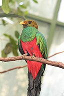
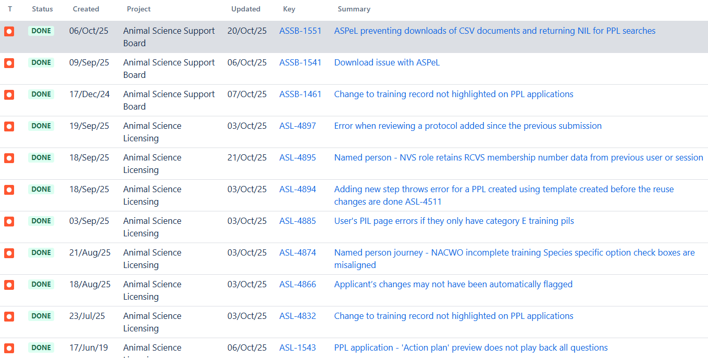

# Summary as of Wednesday 22nd October 2025

## Future research and recruitment 

Thank you for your continued involvement in user research for ASPeL– your participation is integral to understanding the user experience. The research on ASPeL features continues. Please contact our product manager helen.moutain1@homeoffice.gov.uk to participate. Thank you.  
 
# Sprint: 162(quetzal)

Attribution:

Interesting facts about quetzals: quetzals are vividly coloured birds; males feature bright metallic green or blue with deep red on the chest and belly, while females have less vibrant hues of similar colours.

# Completed this Sprint
We completed the following this Sprint:
1) Enabled HBA document replacement without amendment
2) Added notifications for the following:
   a)NP on applications submitted, rejected or returned
   b)NP on applications approved or removed
   c)NP on training due for NACWO and NVS
   d)Notifications for HOLC role and inspector submissions
   e)Overdue training notifications for NTCOs and nominees
   f)Updated notifications for removal refused and removal returned
3) A SPIKE into the behaviour of flags when comments are added in project application
4) Added new panel for 'Courses and category E PILs'
5) Added further updates to the Named Persons' improvements:
   a)corrected the misaligned check boxes in NACWO incomplete training species specific option
   b)Ensured NVS does not retain RCVS membership number/data from a previous user or session.
   c)Added declarations for NIO and NTCO roles
   d)Updated the 'Before you nominate' screen based on feedback
7) Applied a fix to prevent errors appearing when reviewing a protocol added since the previous submission

 

# Bugs done or closed this Sprint

 

# New Sprint 163 (red Kite)

Attribution:

# Planned for this Sprint 162(quetzal)
We will;

1) complete outstanding work on current journeys for the named persons' nominations.
2) complete the ongoing improvements to the'see what's changed' functionality on the 'training records'
3) complete all work in the current Sprint related to the CAT-E tickets
4) on standard protocols: start confluence design guide for developers and update prototype ready for ticket writing.
7) get ASRU sign-off on the new standard protocols and  send out to a wider group for review.
8) on named persons: get 3 new named person guides signed off and write new declaration tickets.
  
   
   

   

## Things to bear in mind
Kindly let us know how we are doing in keeping you informed. We appreciate your feedback on the content of this report. 

