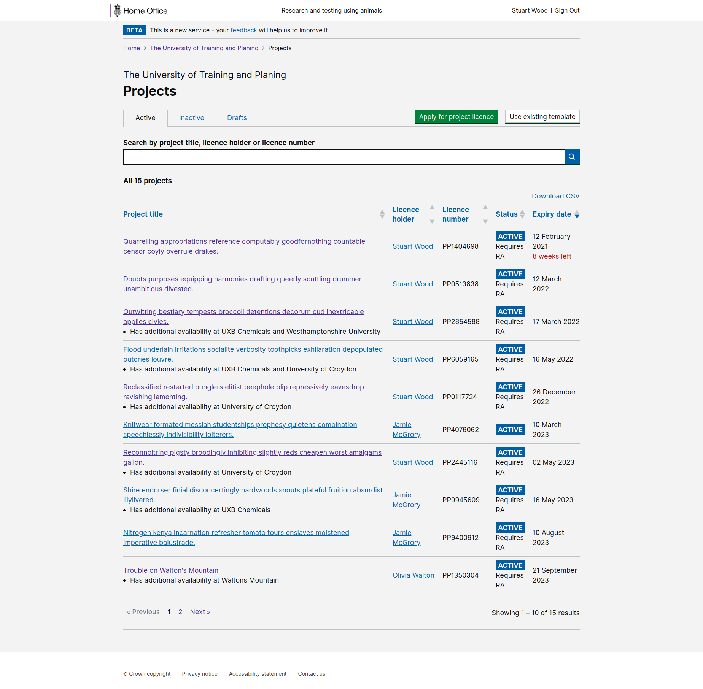

# Summary as of Tuesday 22 December 2020 

# Sprint 74

## Things to bear in mind
* This an unusual sprint because planning happened yesterday
* The next show and tell will be Tuesday January 5th and the next planning Wednesday January 6th 2021
* There will be weekly report next week - back on January 6th 2021

## Just Done
* Completed RoPs prototype testing sessions with inspectors, licensing officers and business support - user research
* Scheduled two sessions with stats team and policy in the first week of the New Year - user research
* Designs for managing newsletter subscriptions in ASPeL - user research
* Designs for showing draft amendments in progress under 'Current activity' of PPL overview
* Content for advanced search designs - content design
* Route all PPL amendments through the PEL holder delegate - working software
* Allow removal of final NACWO from the schedule of premises - working software
* Indicate which PPLs hav availability elsewhere in the PPL list - working software

## About to Do/Doing
* Print view of PPL assessments - content design
* Summarising research findings - user research
* GDPR housekeeping - user research 
* Remove "Manage licence" tab from inspector view - working software
* Granted PPLs should retain RA condition even when trigger is removed - working software
* Use site, area then name for for alphabetical ordering of schedule of premises - working software

## Bugs Fixed this week
The following bugs were fixed this week.
[Bug Fixes week to Tuesday 22 December 2020](graphs/bugs22122020.png)

We planned the following issues in this sprint 
[Sprint 74](graphs/sprint22122020.png)

## Support tickets and known issues
[Link to Support Board](https://collaboration.homeoffice.gov.uk/jira/secure/RapidBoard.jspa?rapidView=1717&selectedIssue=ASSB-253)

[Support board - cached](graphs/supportBoard22122020.png)

## Click here for metrics / progress against plan
[Sprint 74](graphs/progress22122020.png)

[Post Release Roadmap](graphs/roadmap22122020.png)

These were the goals for the current sprint &#x1f98a;
1. Test ROPs with internal users - design and user research ***[Done]***
2. Release PPL for content search for ASRU - working software ***[In progress]*** 

We've planned the following goals for the next sprint &#x1f983;
1. Have a merry \(stable\) xmas 
2. Convert PPL expiry letters into email notifications - content design

1) Test ROPs with internal users - design and user research 2) Release PPL for content search for ASRU - working software (Fox)

## Indicate which PPLs hav availability elsewhere in the PPL list 

 

## Google Analytics for this report
[Google Analytics](graphs/GA22122020.png)

