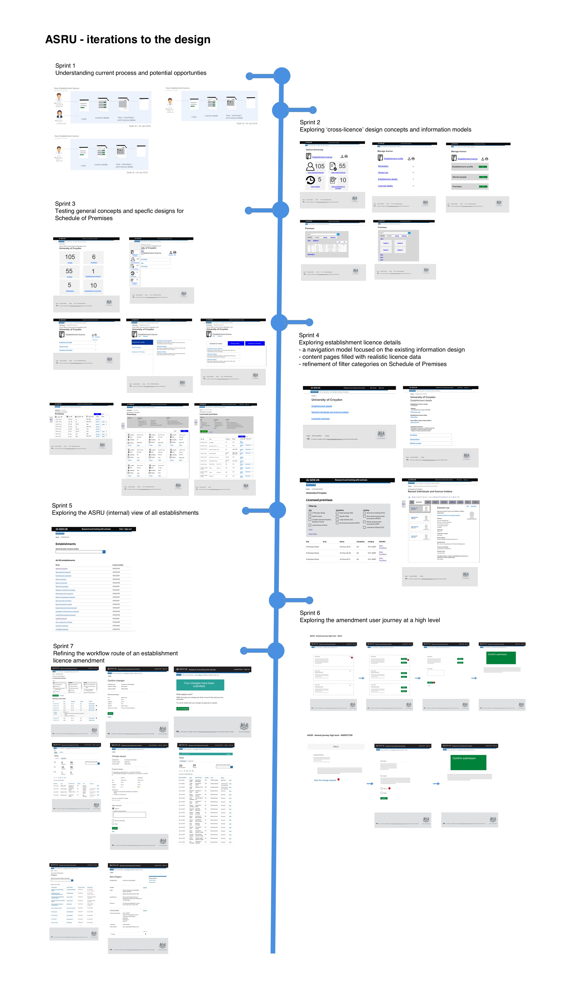

# Summary as of 23rd May 2018 
## What's Blocking us / Issues
* Access to data is still a concern.  After the service review this may well become the issue which is the limiting factor on the speed of development for private Beta.
Possible actions and mitigation to address this will be discussed at the next risk management meeting. 

## Just Done
* Several members of the team attended the ASRU conference in Lancaster
* View establishment details and view licensed premises (ASRU view)
* Design and Testing of prototype for view all project licences

## About to Do/Doing
* View named persons (Establishment user and ASRU view)
* Incorporate design changes for view all project licences based on user testing
* Schedule next round of user research with HOLCs

## Things to be aware of
* The alpha service assessment for the project takes place this Friday 25th May. 

## Click here for our High-Level Road map
[Link to Live Road map in Trello](https://trello.com/b/gDQdE01u/asl-roadmap)    [\(Cached Image\)](graphs/ASLRoadMap23052018.jpg)

## Click here for metrics / progress against plan
[Week 2 - Sprint 8 - Release 1](graphs/progress23052018.png)

## Risks
[Links to Project Risks in Trello](https://trello.com/b/VuFuCL7t/risk-register-and-kpis-asl-delivery)    [\(Cached Image\)](graphs/ASLRiskRegister23052018.jpg)

[Risk Management Chart](graphs/risk23052018.png)

## Sprint Planning
We planned the following issues in sprint planning today
[Link to Issues in Jira](https://jira.digital.homeoffice.gov.uk/secure/RapidBoard.jspa?rapidView=261)    [\(Cached Image\)](graphs/sprint23052018.png)

Our goals for the sprint are
* Pass Alpha service assessment
* Get "development ready" PEL amendments for establishment users
* Develop working software for all view establishment licences for all internal and external users
 
## Sample Design Prototype
For the Alpha service assessment we've produced a timeline of the prototypes that we've created and tested with users since the beginning of the project.

