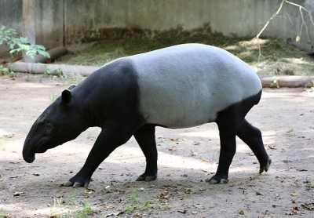
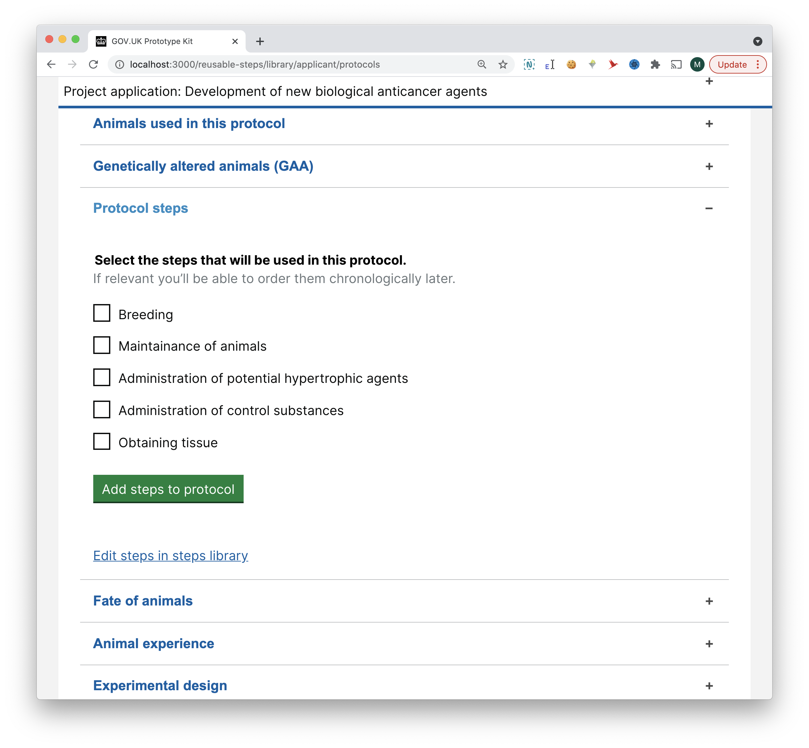

# Summary as of Wednesday 23 June 2021 

# Sprint 87 (tapir)

## Weekly summary
Research on reusable components designs with users has started. Our product manager has rejoined the team.

At the show and tell we demonstrated changes to AWERB endorsements and showed designs that are being tested for PPL component reuse.

## Just Done
* Held RoPs feedback session with an establishment - user research
* Tested the reusable steps prototypes with a new PPL applicant - user research
* Rescheduled a session to next week due to participant unavailability - user research
* Building prototype for testing reusable steps with applicants - design
* Minor improvements to RoPs - design

## About to Do/Doing
* Scheduling two more sessions with PPL applicants to test reusable steps - user research
* Developing designs for inspectors reviewing reusable steps - design
* TEXT_HERE

## Bugs Fixed this week
The following bugs were fixed this week.
[Bug Fixes week to Wednesday 23 June 2021](graphs/bugs23062021.png)

We planned the following issues in this sprint 
[Sprint 87](graphs/sprint23062021.png)

## Support tickets and known issues
[Link to Support Board](https://collaboration.homeoffice.gov.uk/jira/secure/RapidBoard.jspa?rapidView=1717&selectedIssue=ASSB-253)

[Support board - cached](graphs/supportBoard23062021.png)

## Click here for metrics / progress against plan
[Sprint 87](graphs/progress23062021.png)

[Post Release Roadmap](graphs/roadmap23062021.png)

## We set the following goals for this sprint
1. Changes to licence granting workflow - working software 
2. Initial designs for reusable steps with inspectors - design 
3. Complete testing of reusable steps with external users - user research (tapir)

## These were our goals for the previous sprint
1. Prepare designs for reusable component testing - research and design ***[Done]***
2. Cached version of ASRU licence fees - working software ***[Not started]***

## Sample Design Prototypes
### Prototype for testing reusable steps with applicants

 

## Google Analytics for this report
[Google Analytics](graphs/GA23062021.png)

