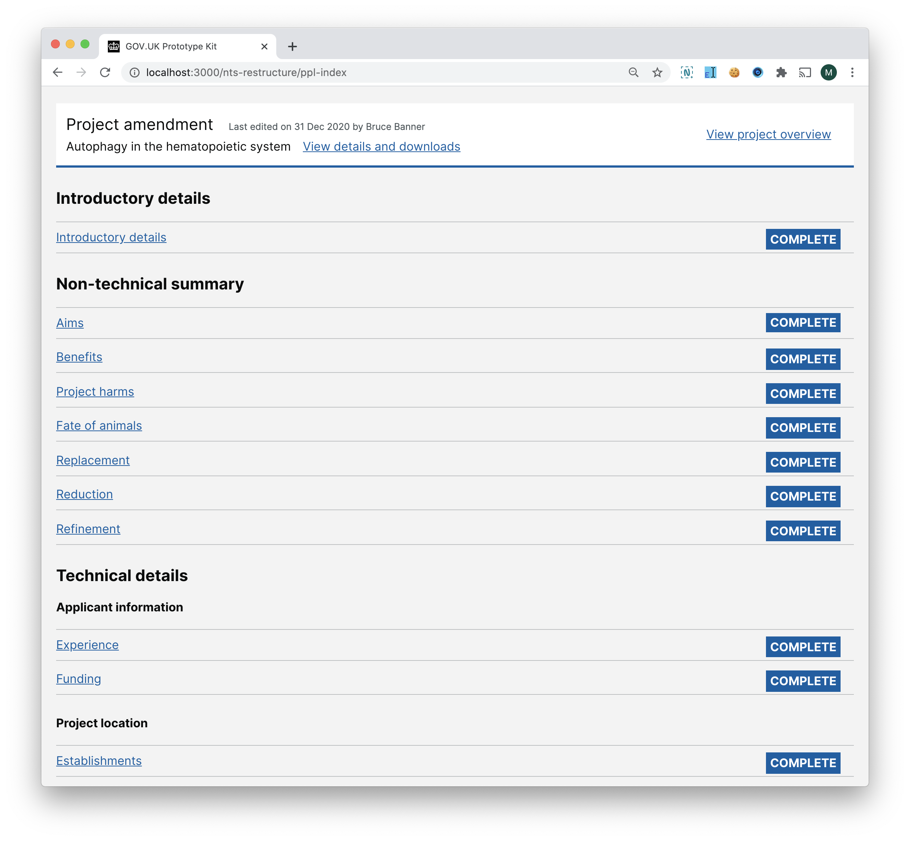

# Summary as of 23 September 2020 

# Sprint 67

## Just Done
* Prototype a restructured NTS within the PPL application and updated PPL overview page layout - design
* Held three research sessions with HOLCs and PPL holders testing the NTS restructure in the PPL application - user research
* Held a RoPs research session with a HOLC from a contract research organisation exploring returns for service licences - user research 
* Scheduled four more research sessions for RoPs with HOLCs and PPL holders - user research
* Fixed issue with missing pil numbers - working softare

## About to Do/Doing
* Iterate the PPL assessments designs - design
* Holding three sessions on NTS restructure in the PPL application - user research
* Holding three sessions on RoPs - user research 
* PIL E - working software
* Support adding mitigations to statutory deadlines that have expired - working software

## Bugs Fixed this week
The following bugs were fixed this week.
[Bug Fixes week to DATE_LONG](graphs/bugs23092020.png)

We planned the following issues in this sprint 
[Sprint SPRINT_NO](graphs/sprint23092020.png)

## Support tickets and known issues
[Link to Support Board](https://collaboration.homeoffice.gov.uk/jira/secure/RapidBoard.jspa?rapidView=1717&selectedIssue=ASSB-253)

[Support board - cached](graphs/supportBoard23092020.png)

## Click here for metrics / progress against plan
[Sprint SPRINT_NO](graphs/progress23092020.png)

[Post Release Roadmap](graphs/roadmap23092020.png)

## Goals for current sprint
1. Cat E PIL release candidate - working software 
2. Iterate PPL assesments - design 
3. Complete research on NTS changes to PPL applications - user research

## Sample Design Prototypes

 

## Google Analytics for this report
[Google Analytics](graphs/GA23092020.png)

