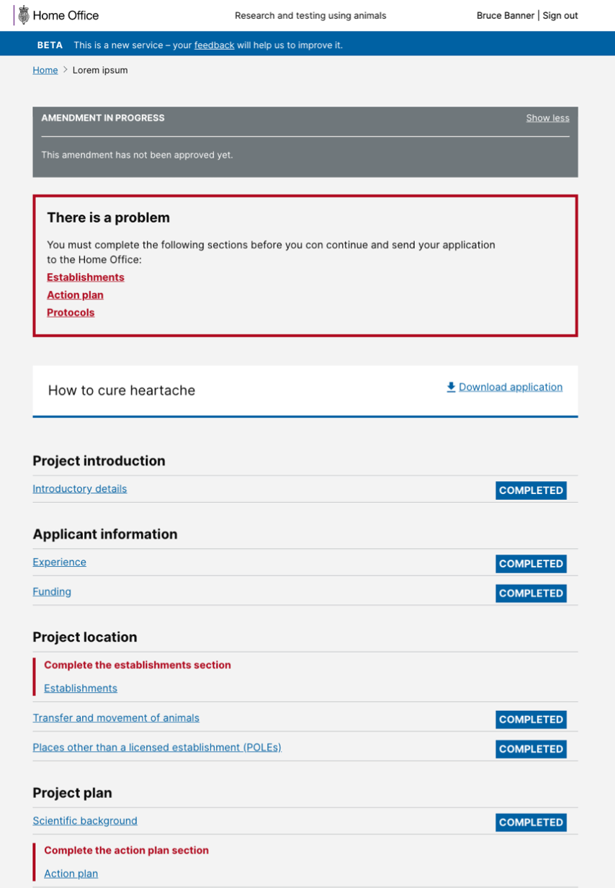
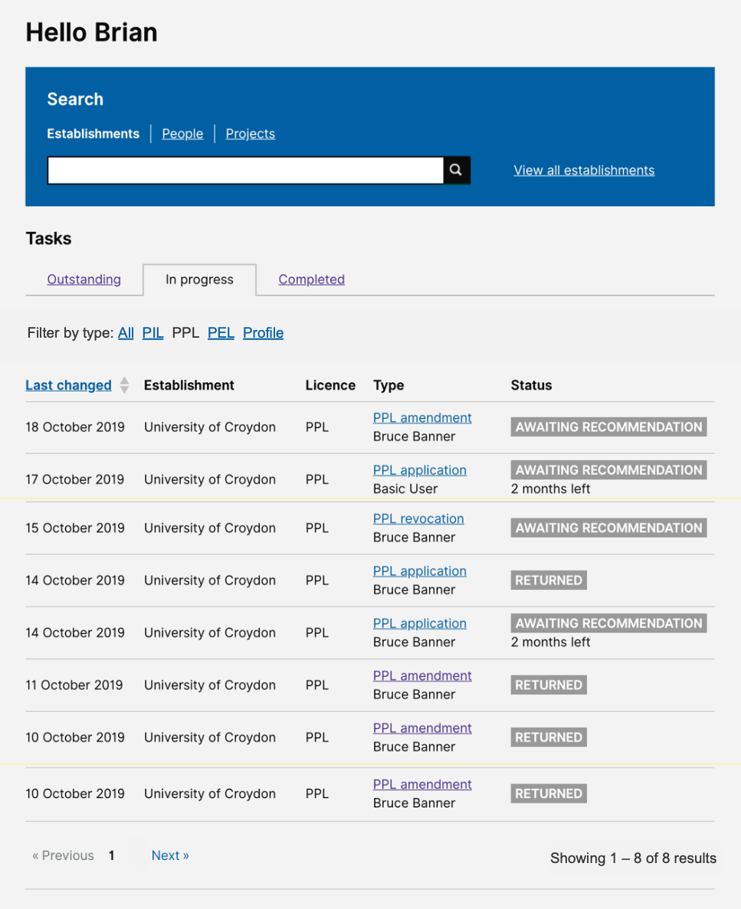

# Summary as of Wednesday 23 October 2019 

# Sprint 44

## Just Done
* Performance improvements for large PPLs
* Image resizing to reduce application size for PPL
* Fix bug with PPL comparison 
* Add more meaningful errors when the application encounters a problem
* Design - show inspector comments on the Word download of PPL

## About to Do/Doing
* Change species selection for PPLs
* Change email address
* Explore ASRU needs for billing - user research
* Plan AWERB review research questions
* Design task type filter for task lists
* Design errors showing parts of PPL application still to be completed

## Bugs Fixed this week
The following bugs were fixed this week.
[Bug Fixes week to Wednesday 23 October 2019](graphs/bugs23102019.png)

We planned the following issues in this sprint 
[Sprint 44](graphs/sprint23102019.png)

## Support tickets and known issues
[Link to Support Board](https://jira.digital.homeoffice.gov.uk/secure/RapidBoard.jspa?rapidView=331&selectedIssue=ALS-47)

[Support board - cached](graphs/supportBoard23102019.jpg)

## Click here for metrics / progress against plan
[Sprint 44](graphs/progress23102019.png)

Our goals for the current sprint are:
1. User Research - explore billing 
2. Design - interface and content improvements 
3. Allow users to change email address - working sofware

## Sample Design Prototypes

 

 

## Google Analytics for this report
[Google Analytics](graphs/GA23102019.png)

