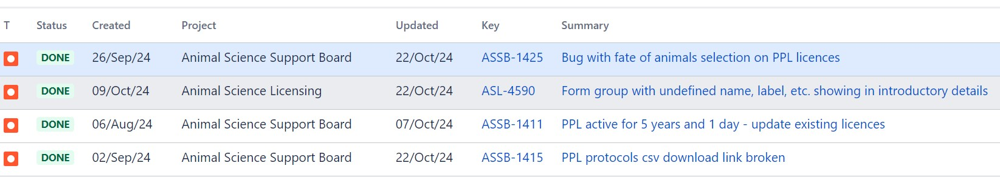

# Summary as of Wednesday 23rd October 2024

## Future research and recruitment 

Thank you for your continued involvement in user research – your participation is integral to understanding the user experience on ASPeL. The research on the Named Persons journey continues. Please contact our user researcher rachel.cholerton@digital.homeoffice.gov.uk to participate. Thank you.  
 

Completed Sprint 149 (Douc)

Attribution:

Fun facts about DOUC - These monkeys wiggle their eyebrows to attract mating partners

# Completed this Sprint: 149 (Douc)
1) Identify any condition on a licence, of which the cosmetic condition is just one example.
2) Text change to 'animals kept alive at a licensed establishment'
3) Add applicant detail to the PDF version of a licence to match the same field on a DOCX download
4) Added change highlighting when steps are moved up or down in protocols
5) Added change highlighting when new steps are added on protocols 
6) Added a new hint text and updated the text to comply with regulations on the 'Forced Swim test' feature in RoPs
7) Completed the first iteration of ITHC(Information Technology Health Check) recommended fixes to improve the ASPeL environment 
   
   

# Bugs Done or Closed this Sprint

# New Sprint: 150(Echidna))

Attribution:

Fun facts about Echidna:
Echidnas like platypus are the only known mammals that reproduce by laying eggs.

## Planned for Sprint 149 (DOUC)

1)Complete (testing) for improving RoPs options by adding Endangered species.
2)Complete the PIL-E MVP (Minimum Viable Product 1 )(adding course details for HE or T purpose) 
3)Complete testing on change highlighting logic change 
4)Start Named Persons' work on MVP1 
5)Standardise authorisations content for rehoming and setting free
6)Complete investigations to upgrade ASPeL internal environment 
7)Standard protocols design ideas 
8)Get Named person guides published on GOV.UK 
10)Complete quick win improvements to establishment hub page on GOV.UK 
11)Licensing data content for Annual Report

   

   

## Things to bear in mind
Kindly let us know how we are doing in keeping you informed. We appreciate your feedback on the content of this report. We are always looking for external testers for our new features designed for you, so get in touch should you be interested.

# Work in progress
1) All outstanding change highlighting errors within ASPeL such as 'changed flag displayed when no chnage has been made', etc 
  

   
 
   
## Support tickets and known issues
[Link to Support Board](https://collaboration.homeoffice.gov.uk/jira/secure/RapidBoard.jspa?rapidView=1717))

  

   
 
   
