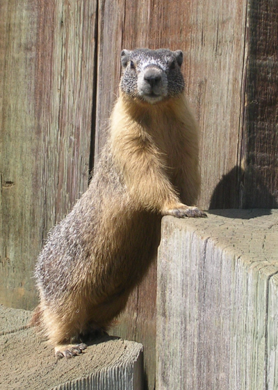
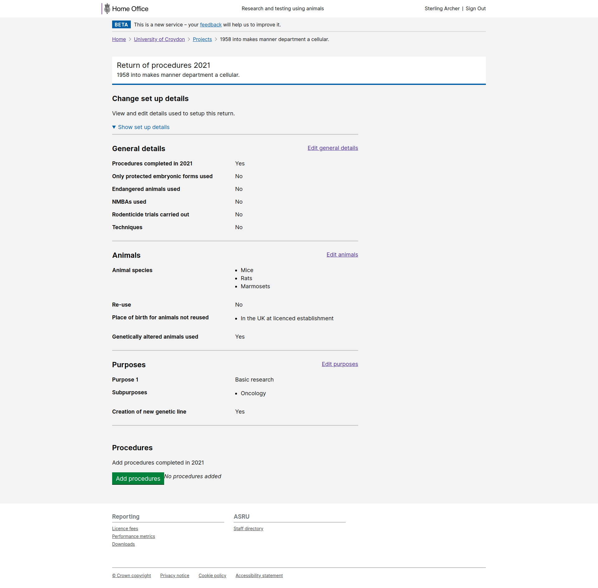

# Summary as of Wednesday 24 March 2021 

# Sprint 80 (Marmot)

## Summary
With only a team of three developers working on ASPeL at the moment, the focus remains on building the end-to-end RoPs journeys. This will only become available to users once the entire journey is complete, but behind the scenes we have built the ability to submit a RoP, and we've begun work on the global consolidated access to the RoPs data. This consolidated data will only be accessible by a select few users (the stats team and specific RoPs inspectors). Individual RoPs will be available to anyone who has permission to see the project, and an establishment-level consolidated view will be available to ASRU and relevant establishment users. We'll be working on these components of the RoPs journey, and others, in the coming weeks.

## Just Done
* TEXT_HERE
* TEXT_HERE
* TEXT_HERE

## About to Do/Doing
* Provide Docx (Word) downloads of previous versions of PPL applications - working software
* Fix csv downloads so they support special characters, such as letters with accents often used in licence holders' name and scientific symbols occasionally used in PPL titles - working software

## Bugs Fixed this week
The following bugs were fixed this week.
[Bug Fixes week to Wednesday 24 March 2021](graphs/bugs24032021.png)

We planned the following issues in this sprint 
[Sprint 80](graphs/sprint24032021.png)

## Support tickets and known issues
[Link to Support Board](https://collaboration.homeoffice.gov.uk/jira/secure/RapidBoard.jspa?rapidView=1717&selectedIssue=ASSB-253)

[Support board - cached](graphs/supportBoard24032021.png)

## Click here for metrics / progress against plan
[Sprint 80](graphs/progress24032021.png)

[Post Release Roadmap](graphs/roadmap24032021.png)

## Our goal for the current sprint is:
* Download a consolidated RoPs report - working software

## Screenshots of software in development
### Return of Procedures submission overview

 

## Google Analytics for this report
[Google Analytics](graphs/GA24032021.png)
