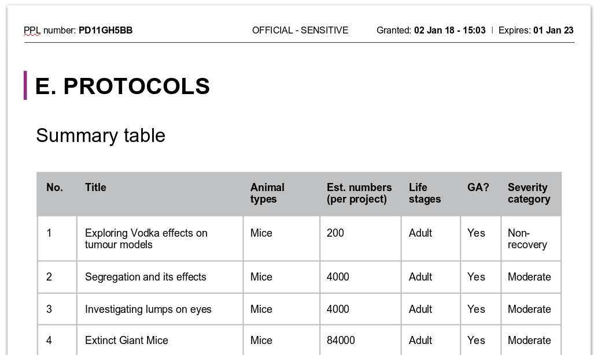
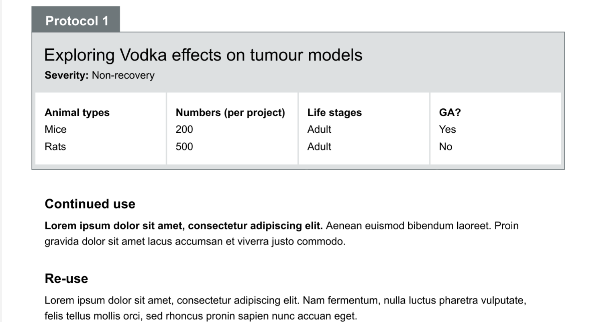

# Summary as of 24th April 2019 

# Sprint 31 - Mid-Sprint

## Just Done
* RRRTEXT_FILL

## About to Do/Doing
* RRRTEXT_FILL

## Things to be aware of
* RRRTEXT_FILL
## Click here for Prioritised Road Map
[Prioritised Road Map](https://trello.com/b/p7x9hbPV/prioritised-roadmap)    [\(Cached Image\)](graphs/ASLRoadMap24042019.jpg)

## Click here for metrics / progress against plan
[Week 2 - Sprint 31 - Release 1](graphs/progress24042019.png)

## Burnup Chart

[Burnup Chart](burnup24042019.md)

## Risks
[Links to Project Risks in Trello](https://trello.com/b/VuFuCL7t/risk-register-and-kpis-asl-delivery) 
[Link to Risk Chart](graphs/risk24042019.png)

## Sprint Planning
* We planned the following issues in sprint planning today [Link to Issues in Jira](https://jira.digital.homeoffice.gov.uk/secure/RapidBoard.jspa?rapidView=261)    [\(Cached Image\)](graphs/sprint24042019.png)

Our goals for the sprint are:

## Screenshots 

 

 

## Google Analytics for this report
[Google Analytics](graphs/GA24042019.jpg)

