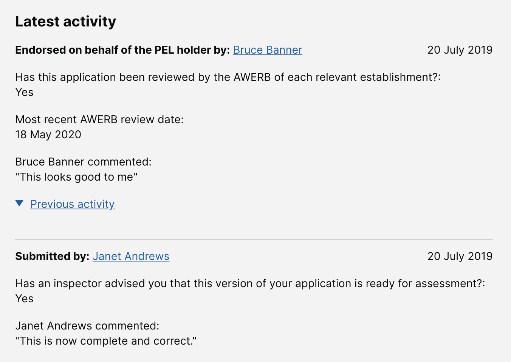

# Summary as of Wednesday 24 June 2020 

# Sprint 61

## Just Done
* Filtering SOP by NACWOs/NVSs/SQPs - working software
* Show an applicant's training at the point of submission on PIL tasks - working software
* Collect / playback NTS Keywords in PPL application - working software
* Add alternate contact number to profile - working software
* Add ASRU Business Support role - working software
* PPL application comments order now newest first - working software
* Implemented new PIL and PPL SLA reports - working software
* Including users answers from submissions in the activity log - design
* Improving messaging around statutory deadlines - design
* Data analysis from Cat E PIL research sessions - user research
* Scheduled sessions with four inspectors to test designs for new features on 1st and 2nd July - user research

## About to Do/Doing
* Remodel PPL submission workflow - working software
* Exploratory work into new search infrastructure - exploration
* Improving how we handle secondary availability - design
* Improving the handling of comments on applications - design
* Changes to category E content following user research - content design
* Preparing for Cat E PIL team debrief - user research 
* Preparing the discussion guide for the sessions with inspectors - user research

## Bugs Fixed this week
The following bugs were fixed this week.
[Bug Fixes week to Wednesday 24 June 2020](graphs/bugs24062020.png)

We planned the following issues in this sprint 
[Sprint 61](graphs/sprint24062020.png)

## Support tickets and known issues
[Link to Support Board](https://collaboration.homeoffice.gov.uk/jira/secure/RapidBoard.jspa?rapidView=1717&selectedIssue=ASSB-253)

[Support board - cached](graphs/supportBoard24062020.png)

## Click here for metrics / progress against plan
[Sprint 61](graphs/progress24062020.png)

[Post Release Roadmap](graphs/roadmap24062020.png)

## These are the goals for the current sprint:

1. Content design for statutory deadlines 
2. Explore search - fuzzy matching 
3. Design improve commenting on applications 
4. Conduct user research with inspectors

## These were the goals for the previous sprint:

1. Complete the research on Cat E PILs ***[Done]*** 
2. Design - Improve task history  ***[Done]***
3. Content design - complete content for PIL-E ***[Done]*** 
4. Working software - reporting RA, PPL SLAs and PILs ***[In Progress]***

## Sample Design Prototypes

 

## Google Analytics for this report
[Google Analytics](graphs/GA24062020.png)

