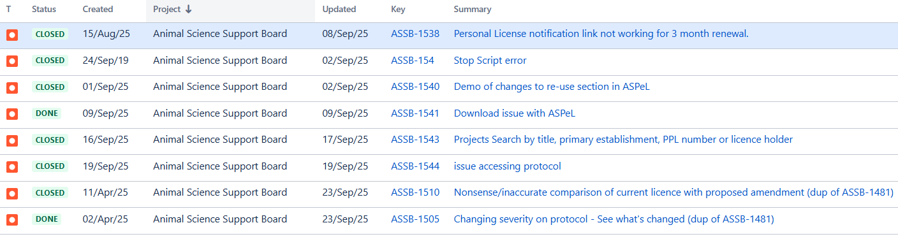

# Summary as of Wednesday 24th September 2025

## Future research and recruitment 

Thank you for your continued involvement in user research for ASPeL– your participation is integral to understanding the user experience. The research on ASPeL features continues. Please contact our user researcher David.utley@digital.homeoffice.gov.uk to participate. Thank you.  
 
# Sprint: 161(Pangolin)

Attribution:

Interesting facts about Pangolins: They are mostly found in Africa and Asia. They have muscular probing tongues to forage for their favourite food, ants. They can deploy a harsh odour to ward off predators.

# Completed this Sprint
We completed the following this Sprint:
1) an exploration of methods for more efficient searching, formatting, and collating non-technical summaries from ASPeL for publishing.
2) a study of techniques to extract personnel performance data from ASPeL.
3) user acceptance testing (UAT) for establishment users nominating people for Named roles has been successfully completed, while work on the inspectors' requirements is ongoing.
4) we enabled RoPs data migration for PPLs moved between establishments.
 

    

# Bugs Done or Closed this Sprint

 

# New Sprint 162 (Quetzal)

Attribution:

Interesting facts about Quetzals: Quetzals are vividly coloured birds; males feature bright metallic green or blue with deep red on the chest and belly, while females have less vibrant hues of similar colours.

# Planned for this Sprint 162(Quetzal)
We will;

1) complete outstanding work on current journeys for the Named Person' nominations.
2) complete the ongoing improvements to the'see what's changed' functionality on the Training Records'
3) complete all work in the current Sprint related to the CAT-E tickets
4) on Standard protocols: start confluence design guide for developers and update prototype ready for ticket writing.
7) get ASRU sign-off on the new standard protocols and  send out to a wider group for review.
8) on Named person: get 3 new named person guides signed off and write new declaration tickets.
  
   
   

   

## Things to bear in mind
Kindly let us know how we are doing in keeping you informed. We appreciate your feedback on the content of this report. 

