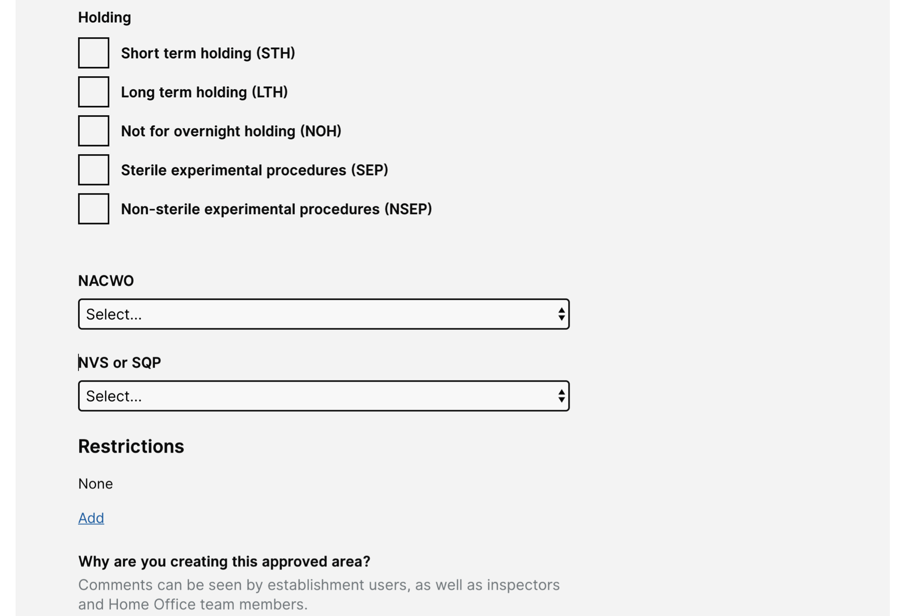

# Summary as of Wednesday 25 March 2020 

# Sprint 54

## Just Done
* PPL Transfer 
* Digitise Paper Licenses
* External user satisfaction survey ready to launch

## About to Do/Doing
* 5 yr PIL Review

## Bugs Fixed this week
The following bugs were fixed this week.
[Bug Fixes week to Wednesday 25 March 2020](graphs/bugs25032020.png)

We planned the following issues in this sprint 
[Sprint 54](graphs/sprint25032020.png)

## Support tickets and known issues
[Link to Support Board](https://collaboration.homeoffice.gov.uk/jira/secure/RapidBoard.jspa?rapidView=1717&selectedIssue=ASSB-253)

[Support board - cached](graphs/supportBoard25032020.png)

## Click here for metrics / progress against plan
[Sprint 54](graphs/progress25032020.png)

[Post Release Roadmap](graphs/roadmap25032020.png)

Our goals for the current sprint are:
1. Deliver PPL transfers 
2. Deliver digitise paper PPLs 
3. Improvements to Named People assignment 
4. Rerun external user satisfaction survey

## Sample Design Prototypes

 

 

## Google Analytics for this report
[Google Analytics](graphs/GA25032020.png)

