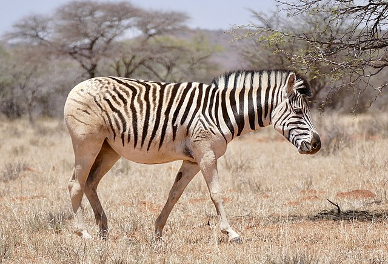

# Summary as of Wednesday 25 May 2022

# Sprint 110 (Quagga)

## Just Done
* Fix issue with multiple versions of the same RA being editable concurrently - working software
* Fix issue with removed additional establishments and previous primary establishments being shown as locations on protocols - working software
## About to Do/Doing
* Improvements to content in enforcement flags - working software
* Reminders for additional conditions on PPLs which need to be actioned by a particular date - working software

## Bugs Fixed this week
The following bugs were fixed this week.
[Bug Fixes week to Wednesday 25 May 2022](graphs/bugs25052022.png)

We planned the following issues in this sprint 
[Sprint 110](graphs/sprint25052022.png)

## Support tickets and known issues
[Link to Support Board](https://collaboration.homeoffice.gov.uk/jira/secure/RapidBoard.jspa?rapidView=1717&selectedIssue=ASSB-253)

[Support board - cached](graphs/supportBoard25052022.png)

## Click here for metrics / progress against plan
[Sprint 110](graphs/progress25052022.png)

[Post Release Roadmap](graphs/roadmap25052022.png)

## The focus for this sprint is:
1. Establish plan and progress time-based conditions - Quagga

## Google Analytics for this report
[Google Analytics](graphs/GA25052022.png)

