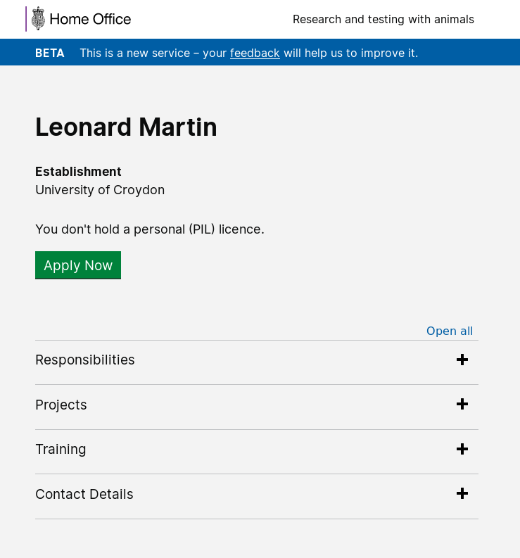

# Summary as of 25th September 2018 

# Sprint 17 - mid-sprint

## What's Blocking us / Issues
* We are still experiencing difficulty in reaching agreement on a method of data migration with the suppliers of the existing system 

## Just Done
* Debriefed team on PPL research 

## About to Do/Doing
* Re-designing PPL application

## Things to be aware of

## Click here for our High-Level Road map
[Link to Live Road map in Trello](https://trello.com/b/gDQdE01u/asl-roadmap)    [\(Cached Image\)](graphs/ASLRoadMap25092018.jpg)

## Click here for metrics / progress against plan
[Week 2 - Sprint 17 - Release 1](graphs/progress25092018.png)

## Burnup Chart
[Burnup Chart](burnup.md)

## Risks
[Links to Project Risks in Trello](https://trello.com/b/VuFuCL7t/risk-register-and-kpis-asl-delivery)    [\(Cached Image\)](graphs/ASLRiskRegister25092018.jpg)

[Risk Management Chart](graphs/risk25092018.png)

## Sprint Planning
* We planned the following issues in sprint planning today [Link to Issues in Jira](https://jira.digital.homeoffice.gov.uk/secure/RapidBoard.jspa?rapidView=261)    [\(Cached Image\)](graphs/sprint25092018.png)

Our goals for the sprint are:
* Conclude PPL Exploration and feedback to team
* Add named People and PIL DEF
* PIL Application, Front End

## Sample Design Prototype - Apply for a PIL
username: holc
password: holc

