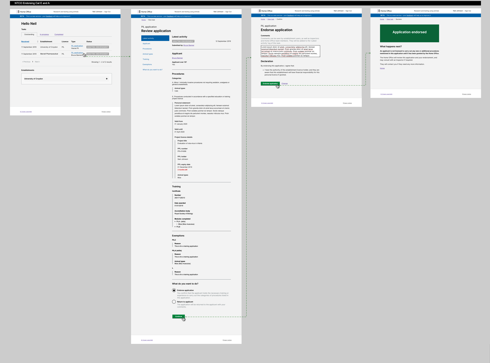
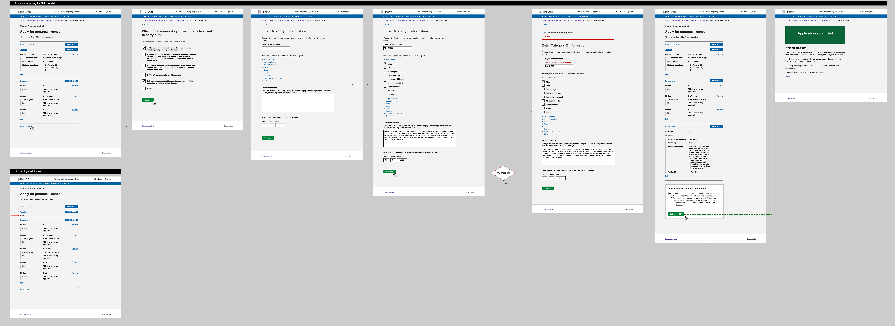

# Summary as of 25th September 2019 

# Sprint 42

## Just Done
Bug fixes:
* Task list sort orders
* PPL holder details in document exports and legacy digital views
* Duplicate commenting
* PIL application for revoked PILs held elsewhere
* Comment visibility in PPL feedback cycle
* Visibility of unsubmitted PPL drafts
* Hide deadline on recalled PPL applications
* Reduce payload size for PPL editing requests - reduce probability of large payload errors
* Handle full removal of ASRU roles
 
Design and User Research:
* Cat E pills initial user research and testing - will investigate a further iteration

## About to Do/Doing
* Further bug fixes
* PPL and PIL transfers

## Things to be aware of
* One developer has left the team
* Our content designer will leave the team at the end of the week

## Bugs Fixed this week
The following bugs were fixed this week.
[Bug Fixes week to 25th September 2019](graphs/bugs25092019.jpg)

We planned the following issues in this sprint 
[Sprint 42](graphs/sprint25092019.png)

## Support tickets and known issues
[Link to Support Board](https://jira.digital.homeoffice.gov.uk/secure/RapidBoard.jspa?rapidView=331&selectedIssue=ALS-47)

[Support board - cached](graphs/supportBoard25092019.jpg)

## Click here for metrics / progress against plan
[Week 2 - Sprint 42 - Release 1](graphs/progress25092019.png)

Our goals for the sprint are:
1. User Research for Category E PILs 
2. Explore PPL/ PELH approval

## Sample Design Prototypes

 

 

## Google Analytics for this report
[Google Analytics](graphs/GA25092019.jpg)

