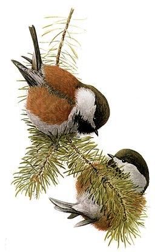

# Summary as of Wednesday 25th September 2024

## Future research and recruitment 

Thank you for your continued involvement in user research – your participation is integral to understanding the user experience on ASPeL. The research on the Named Persons journey continues. Please contact our user researcher rachel.cholerton@digital.homeoffice.gov.uk to participate. thank you.  
 

Completed Sprint 148 (Chikadee)

Attribution:

# Completed this Sprint: 148 (Chikadee)
1) Add species held data to establishments csv for audit
2) Display Removed flag in protocols' steps
3) Add forced swim test to RoPs special techniques
4) Planning content testing

 

# Bugs Done or Closed this Sprint

# New Sprint: 149(Douc)

Attribution:

Fun facts about DOUC - These monkeys wiggle their eyebrows to attract partners.

## Planned for Sprint 149 (DOUC)

1)Finish RoPs tickets reported on the ASPeL board
2)Complete Named Persons handover documents to developers
3)Design a single standard protocol
4)Continue work on Change highlighting error tickets
5)Finish ITHC work
6)Add Named Persons guidance documents to gov.uk with links from ASPeL
7)Distribute in-ASPeL usage guides to users via email
   

   

## Things to bear in mind
Kindly let us know how we are doing in keeping you informed. We appreciate your feedback on the content of this report.

# Work in progress
1) All outstanding change highlighting errors within ASPeL such as 'changed flag displayed when no chnage has been made', etc 
  

   
 
   
## Support tickets and known issues
[Link to Support Board](https://collaboration.homeoffice.gov.uk/jira/secure/RapidBoard.jspa?rapidView=1717))

  

   
 
   
