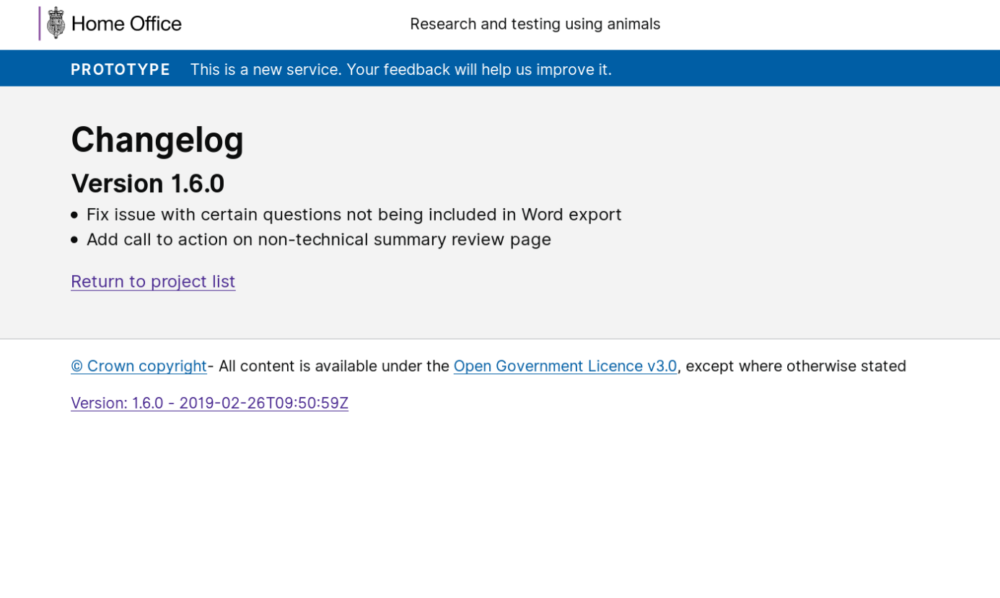
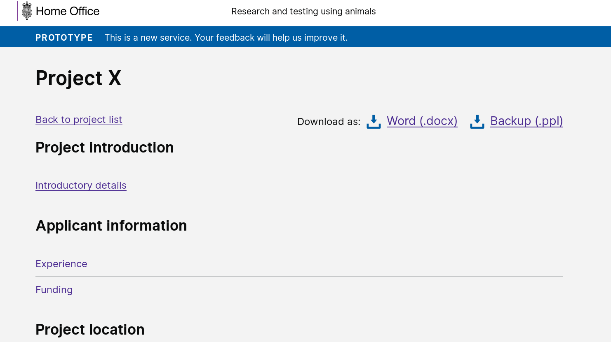

# Summary as of 26th February 2019 

# Sprint 27

## Just Done
* Begun development of scenario and user research for legacy PIL amendment lifecycle
* Development of working software for PPL submission

## About to Do/Doing
* Research with inspectors for reviewing, providing feedback and recommending a PPL application
* Designs (for PPL review) and feedback at the show and tell next week 
* Email notifications for significant changes in workflow

## Things to be aware of
* Project Governance Review is today in 2MS
* We intend to release a new maintenance release of the PPL drafting tool roughly once a week on a Monday. Detail of what will be in each release will be here [https://ppl-prototype.herokuapp.com/changelog](https://ppl-prototype.herokuapp.com/changelog)

## Click here for Prioritised Road Map
[Prioritised Road Map](https://trello.com/b/p7x9hbPV/prioritised-roadmap)    [\(Cached Image\)](graphs/ASLRoadMap26022019.jpg)

## Click here for metrics / progress against plan
[Week 2 - Sprint 27 - Release 1](graphs/progress26022019.png)

## Burnup Chart
[Burnup Chart](burnup26022019.md)

## Risks
[Links to Project Risks in Trello](https://trello.com/b/VuFuCL7t/risk-register-and-kpis-asl-delivery) 
 
[Link to Risk Chart](graphs/risk26022019.png)

## Sprint Planning
* We planned the following issues in sprint planning
 
[Link to Issues in Jira](https://jira.digital.homeoffice.gov.uk/secure/RapidBoard.jspa?rapidView=261)    [\(Cached Image\)](graphs/sprint26022019.png)

Our goals for the sprint are:
* Project Application Submission 
* Send notification emails 
* Legacy PPL amendment lifecycle 
* Test University of Croydon with Licensing Officers 
* Design granting PPL (standard conditions, etc)

## Screenshots of the PPL application prototype

 

 

## Google Analytics for this report

This shows:
* total number of users
* number of new users

[Google Analytics](graphs/GA26022019.jpg)

