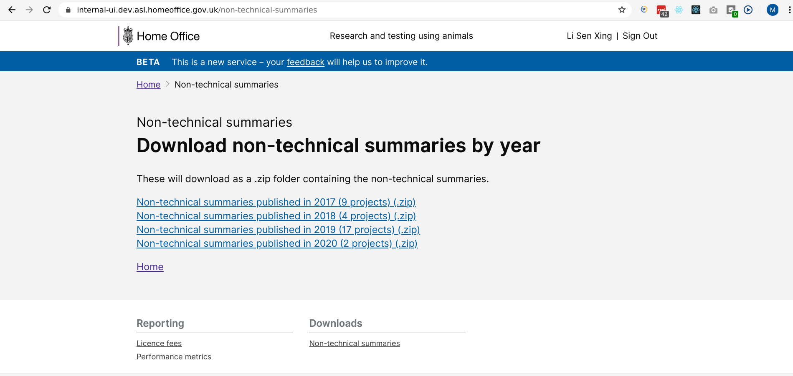
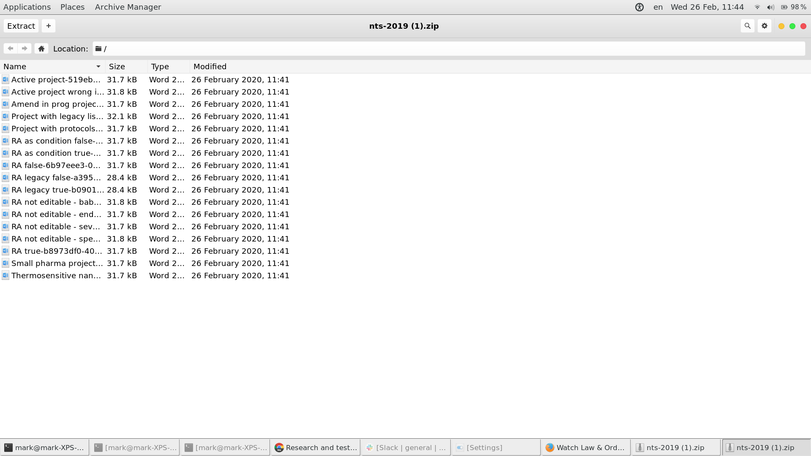

# Summary as of Wednesday 26 February 2020 

# Sprint 52

## Just Done
* Added NTS downloads for 2019 and 2020 including new-style PPLs 

## About to Do/Doing
* Digitising paper PPLs and PPL transfers
* PPL transfers between establishments 
* Digitising legacy project licences
* Designs for PPL transfer
* Iteration of assessments designs 
* Initial designs for protocol summary tables

## Bugs Fixed this week
The following bugs were fixed this week.
[Bug Fixes week to Wednesday 26 February 2020](graphs/bugs26022020.png)

We planned the following issues in this sprint 
[Sprint 52](graphs/sprint26022020.png)

## Support tickets and known issues
[Link to Support Board](https://collaboration.homeoffice.gov.uk/jira/secure/RapidBoard.jspa?rapidView=1717&selectedIssue=ASSB-253)

[Support board - cached](graphs/supportBoard26022020.png)

## Click here for metrics / progress against plan
[Sprint 52](graphs/progress26022020.png)

[Post Release Roadmap](graphs/roadmap26022020.png)

Our goals for the current sprint are:
1. Digitise Paper Licences 
2. User Research - Inspector assessment 3rd round 
3. Continue Assessment Design work

## Sample Design Prototypes

 

 

## Google Analytics for this report
[Google Analytics](graphs/GA26022020.png)

