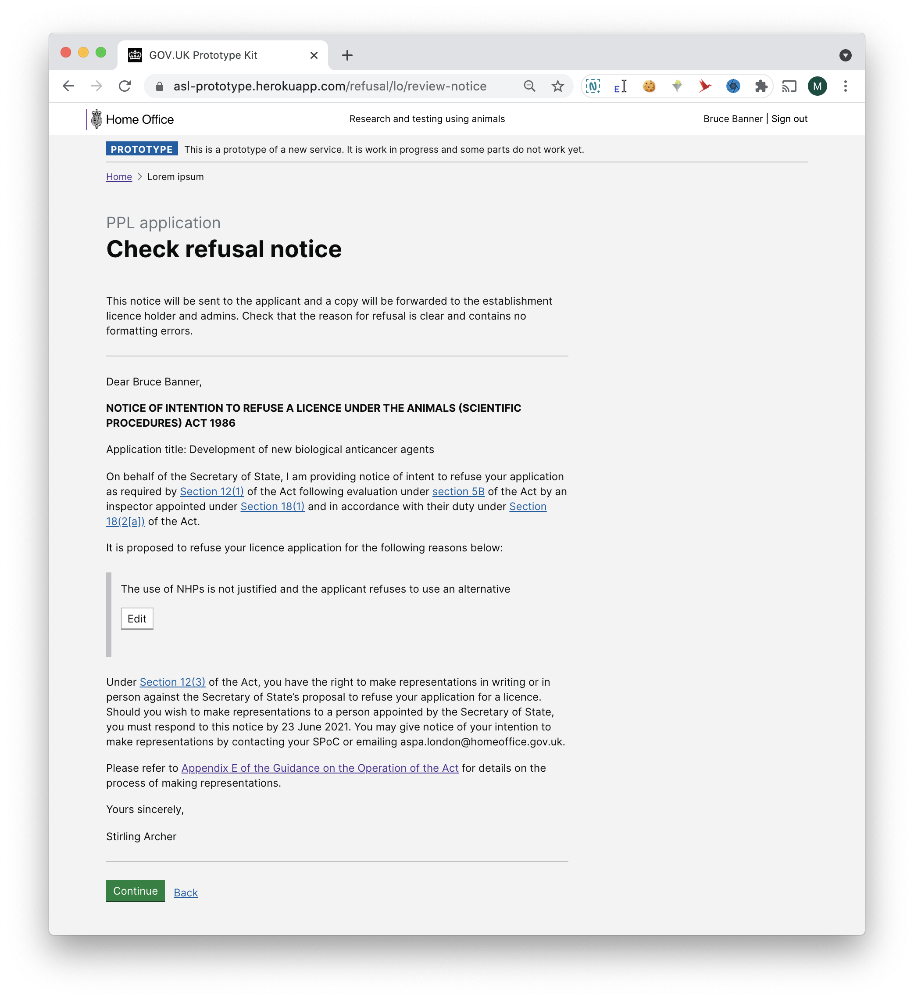

# Summary as of Wednesday 26 May 2021 

# Sprint 85

## Weekly summary 

This sprint we began research on reusable components for Protocols in PPL application. Development was focussed on improvements to existing RA, ROPs functionality and PPL notifications.

## Just Done
* Refuse a PPL journey - design
* Small improvements to the RoP journey - design
* TEXT_HERE
* TEXT_HERE
* TEXT_HERE

## About to Do/Doing
* Exploring reusable components in the PPL, some general improvements to the system interface
* TEXT_HERE
* TEXT_HERE

## Bugs Fixed this week
The following bugs were fixed this week.
[Bug Fixes week to Wednesday 26 May 2021](graphs/bugs26052021.png)

We planned the following issues in this sprint 
[Sprint 85](graphs/sprint26052021.png)

## Support tickets and known issues
[Link to Support Board](https://collaboration.homeoffice.gov.uk/jira/secure/RapidBoard.jspa?rapidView=1717&selectedIssue=ASSB-253)

[Support board - cached](graphs/supportBoard26052021.png)

## Click here for metrics / progress against plan
[Sprint 85](graphs/progress26052021.png)

[Post Release Roadmap](graphs/roadmap26052021.png)

## Our goals for the current sprint are:
1. Collaborator edit access on PPLs - working software 
2. Initial designs for re-usable components - design Rhinoceros

## Out goals for the previous sprint were:
1. Plan and prepare testing for "Refuse a PPL" - design and user research ***[Done]***
2. Improve messaging around RA requirements - Working software ***[Done]***

## Sample Design Prototypes
### Refuse a PPL journey

 

## Google Analytics for this report
[Google Analytics](graphs/GA26052021.png)

