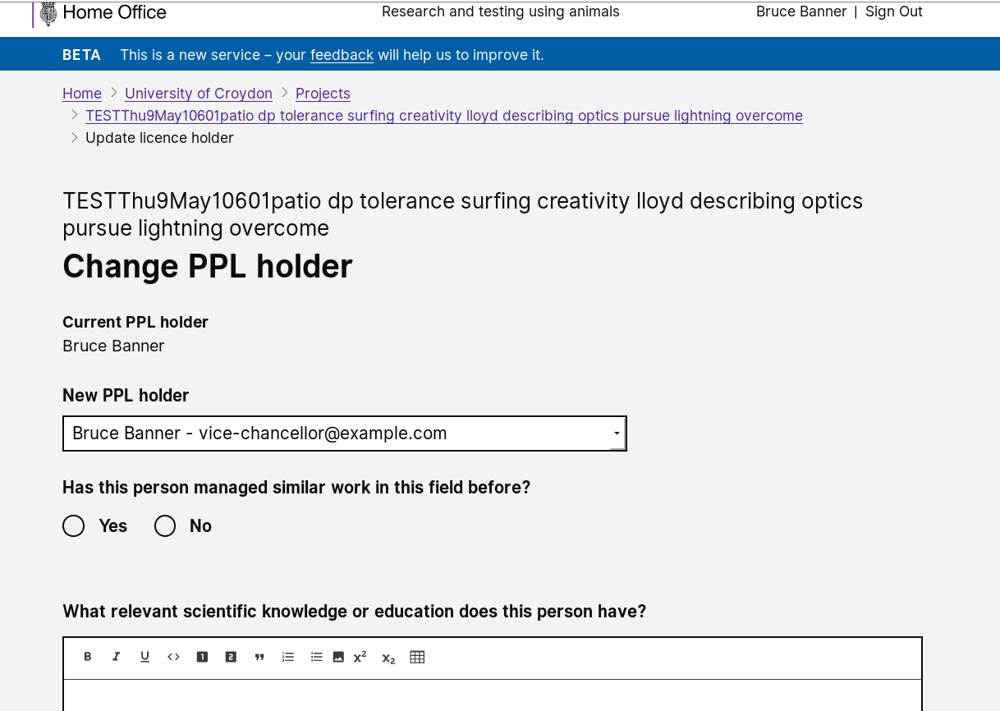

# Summary as of 26th June 2019 

# Sprint

## What's Blocking us / Issues
* RRRTEXT_FILL

## Just Done
* RRRTEXT_FILL

## About to Do/Doing
* RRRTEXT_FILL

## Things to be aware of
* RRRTEXT_FILL
## Click here for Prioritised Road Map
[Prioritised Road Map](graphs/ASLRoadMap26062019.jpg)

## Click here for metrics / progress against plan
[RRRWEEK_SPRINT_RELEASE](graphs/progress26062019.png)

## Burnup Chart

[Burnup Chart](burnup26062019.md)

## Risks
[Links to Project Risks in Trello](https://trello.com/b/VuFuCL7t/risk-register-and-kpis-asl-delivery) 
[Link to Risk Chart](graphs/risk26062019.png)

## Sprint Planning
* We planned the following issues in sprint planning [Link to Issues in Jira](https://jira.digital.homeoffice.gov.uk/secure/RapidBoard.jspa?rapidView=261)    [\(Cached Image\)](graphs/sprint26062019.png)

Our goals for the sprint are:
* RRR_TEXT_FILL

## Screenshots of the working software 

 

 

## Google Analytics for this report
[Google Analytics](graphs/GA26062019.jpg)

