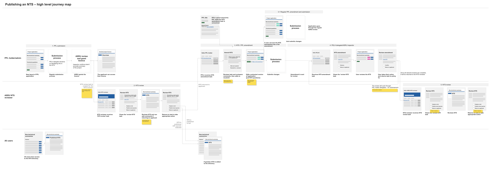

# Summary as of Wednesday 26 August 2020 

# Sprint 65

## Just Done
* Iterated the retrospective assessment submission flow - design
* Developed a high level journey map for publishing the RAs and NTSs - design
* Accessibility improvements to colour contrast - design
* Iterations to managing additional availability designs, the contact us page and ASRU's staff directory - content design
* Accessibility improvements based on results of initial audit - working software
* Application process for Category E PILs (ongoing) - working software
* Improvements to activity log views in tasks - working software
* Migration to new deployment infrastructure which provides much improved time-to-live for critical fixes
* Addition of visual regression testing to improve reliability by reducing risk of unintended side effects when deploying changes

## About to Do/Doing
* Building out a detailed flow for publishing RAs and NTSs, reviewing the earlier PPL assessment work - design
* Iterations to the NTS digital review and exploring changes to general comments fields - content design
* Continued work on Category E PIL application, endorsement and grant process - working software
* Improvements to UI and user journeys around PPL statutory deadlines - working software

## Bugs Fixed this week
The following bugs were fixed this week.
[Bug Fixes week to Wednesday 26 August 2020](graphs/bugs26082020.png)

We planned the following issues in this sprint 
[Sprint 65](graphs/sprint26082020.png)

## Support tickets and known issues
[Link to Support Board](https://collaboration.homeoffice.gov.uk/jira/secure/RapidBoard.jspa?rapidView=1717&selectedIssue=ASSB-253)

[Support board - cached](graphs/supportBoard26082020.png)

## Click here for metrics / progress against plan
[Sprint 65](graphs/progress26082020.png)

[Post Release Roadmap](graphs/roadmap26082020.png)

## These are the goals for the current sprint:

1. Design - Publishing process for NTSs and RAs 
2. Dev - Apply for Cat E PILs 
3. General - Accessibility improvements

## Sample Design Prototypes

 

 

## Google Analytics for this report
[Google Analytics](graphs/GA26082020.png)

