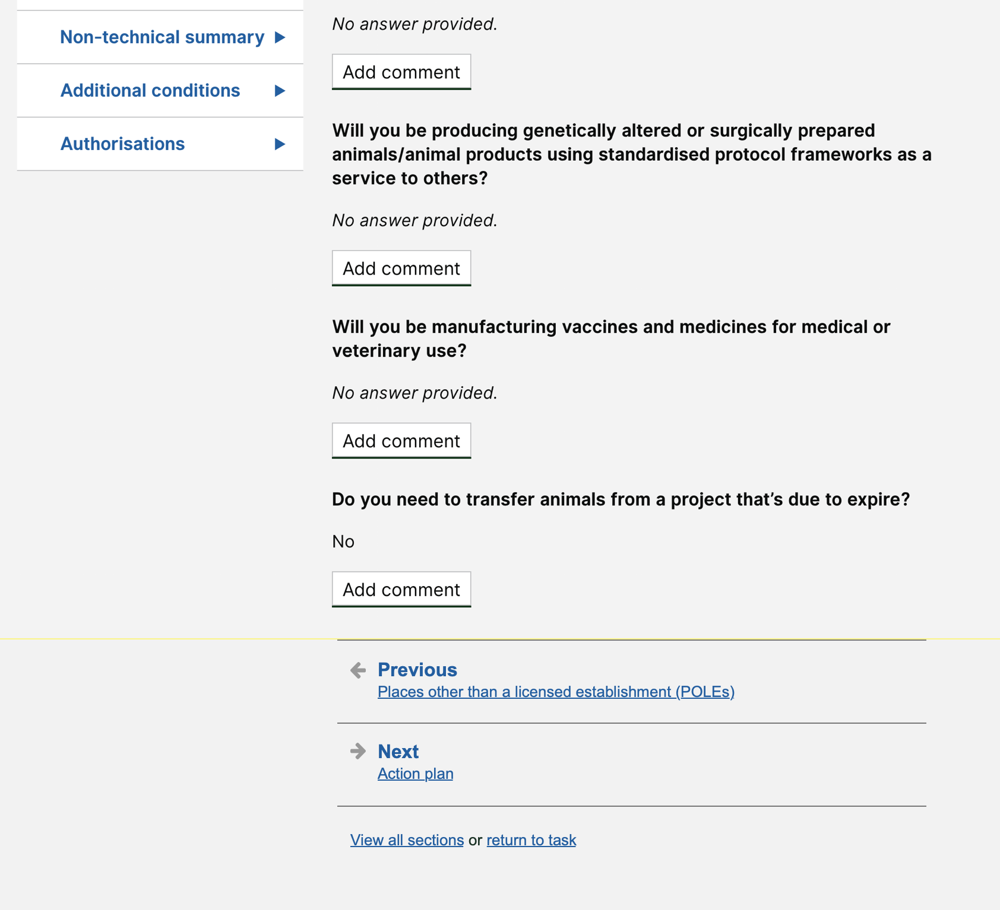

# Summary as of Wednesday 27 May 2020 

# Sprint 59

## Just Done
* Working software - PPL application PDF download
* Tested training profiles with ASRU users and with establishments
* Design - improve inspector navigation on PPL Applications

## About to Do/Doing
* User research - arrange research for PIL-E with existing PIL holders
* Design - Show "current" and "proposed" for PIL amendments 
* Content Design - improve inspector navigation on PPL Applications
* Working software - show tasks related to a licence 

## Bugs Fixed this week
The following bugs were fixed this week.
[Bug Fixes week to Wednesday 27 May 2020](graphs/bugs27052020.png)

We planned the following issues in this sprint 
[Sprint 59](graphs/sprint27052020.png)

## Support tickets and known issues
[Link to Support Board](https://collaboration.homeoffice.gov.uk/jira/secure/RapidBoard.jspa?rapidView=1717&selectedIssue=ASSB-253)

[Support board - cached](graphs/supportBoard27052020.png)

## Click here for metrics / progress against plan
[Sprint 59](graphs/progress27052020.png)

[Post Release Roadmap](graphs/roadmap27052020.png)

Our goals for the previous sprint were
1. Conduct training profile user research ***[In Progress]***
2. Design - Cat E applications for existing PIL holders ***[In Progress]***
3. Development PPL application download as pdf ***[Done]***

Our goals for the current sprint are:
1. Working software - show tasks related to a licence 
2. Design - manage statutory PPL deadlines 
3. Content - review success messages 
4. User Research Cat-E with existing PIL holders

## Sample Design Prototypes

 

## Google Analytics for this report
[Google Analytics](graphs/GA27052020.png)

