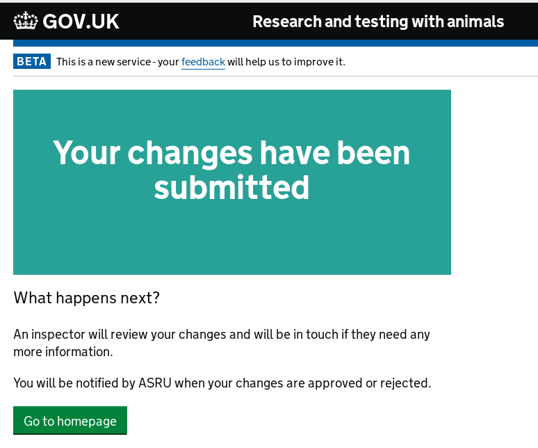
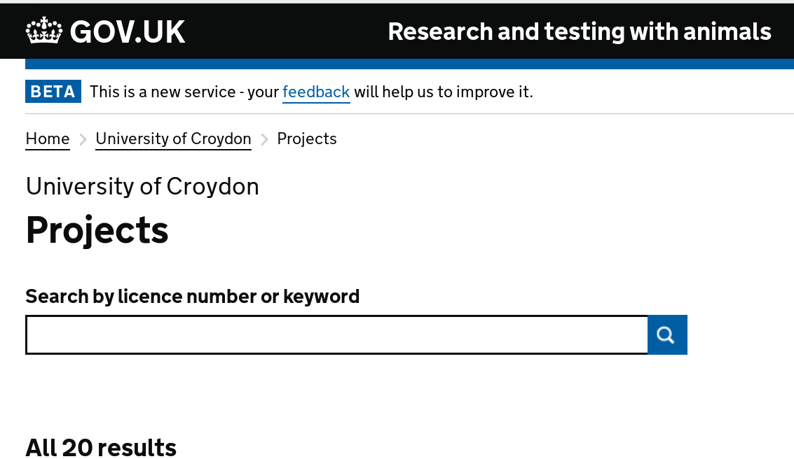

# Summary as of 27th June 2018 
# Sprint 11
## What's Blocking us / Issues
We have added two potential risks to the risk register to be discussed at next meeting:
* On the back of receiving Authority to Operate (ATO) we are sensitive that there might be issues regarding data quality which may need addressing
* We have highlighted in retrospective the need to limit and control scope through user research/design and development

## Just Done
* Develop working software for add/remove room from external users
* Design iterations of inbox and amendment journeys for all views
* User research with inspectors for add a room as part of amending an establishment licence

## About to Do/Doing
* Development of working software for the "end to end" amendment journey
* Incorporation of findings from user research with HOLCs and inspectors into designs
* Iteration of designs for inboxes for inspectors and HOLCs

## Things to be aware of
* Tomorrow the team are running a combination "Show and Tell" and research event with 40+ HOLCs 

## Click here for our High-Level Road map
[Link to Live Road map in Trello](https://trello.com/b/gDQdE01u/asl-roadmap)    [\(Cached Image\)](graphs/ASLRoadMap27062018.jpg)

## Click here for metrics / progress against plan
[Week 1 - Sprint 11 - Release 1](graphs/progress27062018.png)

## Risks
[Links to Project Risks in Trello](https://trello.com/b/VuFuCL7t/risk-register-and-kpis-asl-delivery)    [\(Cached Image\)](graphs/ASLRiskRegister27062018.jpg)

[Risk Management Chart](graphs/risk27062018.png)

## Sprint Planning
* We planned the following issues in sprint planning today [Link to Issues in Jira](https://jira.digital.homeoffice.gov.uk/secure/RapidBoard.jspa?rapidView=261)    [\(Cached Image\)](graphs/sprint27062018.png)

Our goals for the sprint are
* Develop working software for add/remove room from external users
* Design iterations of inbox and amendment journeys for all views
* User research with inspectors for add a room as part of amending an establishment licence

## Sample Design Prototype
* Links to demonstrated working software:

Username: holc

Password: holc

Username: inspector

Password: inspector

